# Spetsifikatsioonipõhine arendus

Spetsifikatsioonipõhine arendus (spec-driven development) on tarkvaraarenduse lähenemine, kus detailsed spetsifikatsioonid (spec) on esmane sisend AI-agentidele koodi genereerimiseks. Selle asemel, et arendaja tõlgendaks ebamääraseid nõudeid, kirjutavad analüütikud ja arhitektid täpsed, masinloetavad spetsifikatsioonid, mille põhjal AI-agent teostab koodi ennustatavalt ja järjepidevalt. See lähenemine vähendab tõlgendusvigasid, kiirendab arendust ja tagab, et dokumentatsioon püsib koodiga alati sünkroonis.

## Miks mitte lihtsalt "vibe coding"?

AI-agentidega arendamisel on kiusatus lihtsalt öelda: "Tee mulle autentimissüsteem" ja loota, et agent teeb õige asja. Seda nimetatakse **"vibe coding"** ehk tunnetuspõhiseks kodeerimiseks — kiire prototüüpimine, kus AI arvab ära, mida sa tahad.

| Lähenemine | Sobib | Ei sobi |
| :--------- | :---- | :------ |
| **Vibe coding** | Kiired prototüübid, eksperimendid, ühekordsed skriptid | Tootmissüsteemid, meeskonnatöö, pikaajaline hooldus |
| **Spetsifikatsioonipõhine arendus** | Tootmissüsteemid, meeskonnatöö, auditeeritavus | Kiired katsetused, kus tulemus pole kriitiline |

**Vibe coding'u probleemid:**

- AI teeb mõistlikke oletusi, aga mõned neist on valed — ja sa avastad selle alles hiljem
- Puudub jagatud arusaam meeskonnas — iga arendaja saab erineva tulemuse
- Arhitektuuriotsused lukustuvad koodi, mitte dokumentatsiooni
- Raske hiljem muuta, sest "miks nii tehti" pole kusagil kirjas
- **Kiirus peidab probleeme** — AI genereerib koodi nii kiiresti, et vigased oletused jõuavad tootmisesse enne, kui keegi jõuab neid märgata

**Spetsifikatsioonipõhine arendus lahendab need probleemid:**

- Spetsifikatsioon (spec) on jagatud tõe allikas, mida kõik loevad
- AI-agent ei arva — ta täidab täpselt seda, mis on kirjas
- Arhitektuuriotsused on dokumenteeritud ja ülevaadatavad
- Muudatused algavad spetsifikatsioonist, mitte koodist

> **Põhimõte:** Kood ei ole parim koht nõuete läbirääkimiseks. Spetsifikatsioon on.

## Osa 1: Probleem täna

Praegune töökorraldus on killustunud: info ja "tõde" elavad Confluence'is, Jira piletites, Wordi failides, Enterprise Architecti joonistes, koosolekute memodes ning eraldi Git/Bitbucket repos.

### Kus info tegelikult elab

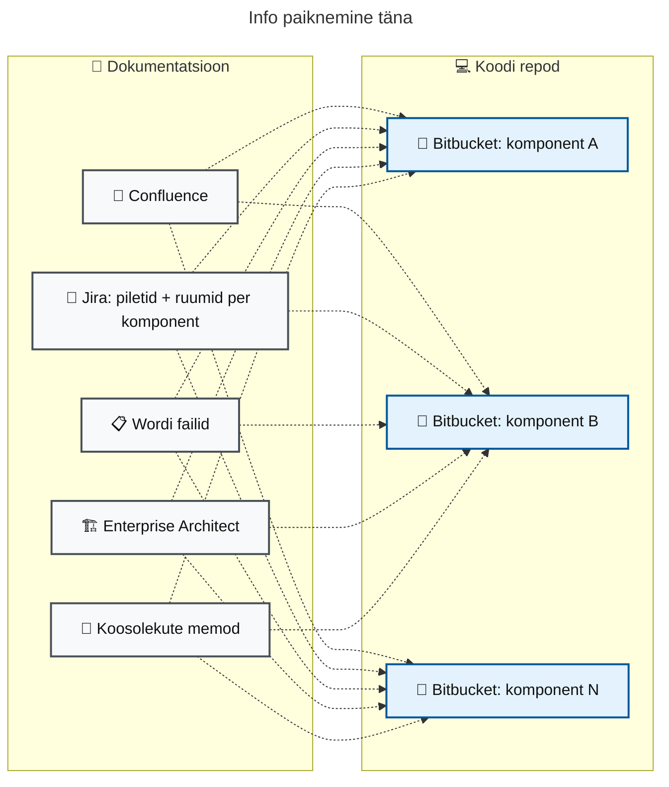

### Scrumi protsess täna

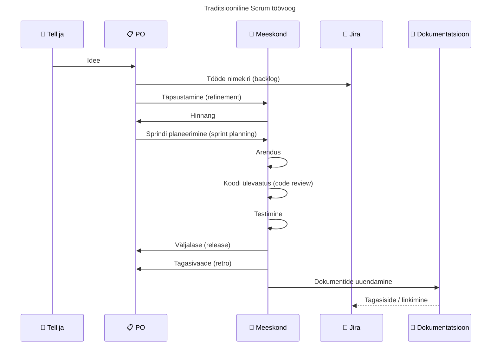

### Tagajärjed

- Dokumentatsioon vananeb kiiremini kui kood
- Dokumentatsiooni versioonihaldus on ebamugav (muudatuste jälgimine (track changes), Confluence versioonid)
- Otsused on laiali (piletid, Word, EA, Confluence, memod)
- Jälgitavus (traceability) on nõrk (raske siduda nõue → kood)
- Sisseelamine (onboarding) on aeglane, info asub mitmes kohas
- Ühe komponendi muutus vajab mitme repo ja Jira ruumi läbimist

**Põhiprobleem:** Kood ja dokumentatsioon ei asu samas süsteemis ning "tõde" on hajunud.

## Osa 2: Lahendus — spetsifikatsioonipõhine arendus

Kerge töövoog, kus **PO** prioritiseerib ja kinnitab, **analüütik** kirjutab nõuded, **arhitekt** lisab tehnilise disaini, **AI-agent** teostab ning jälgib edenemist ja **E2E testija** tagab kvaliteedi läbivate testidega. Analüüs ja arhitektuur on keskse süsteemi repositooriumis, teostus võib olla ühes või mitmes koodirepos ning "end-to-end" testid eraldi testirepos.

### Keskne repo + Cursor rollid

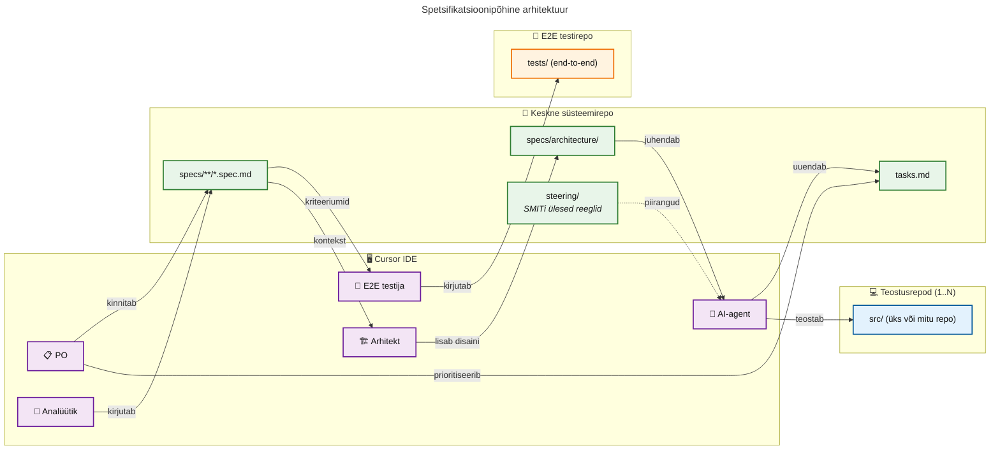

### Üks spetsifikatsioonide repo → mitu koodirepo

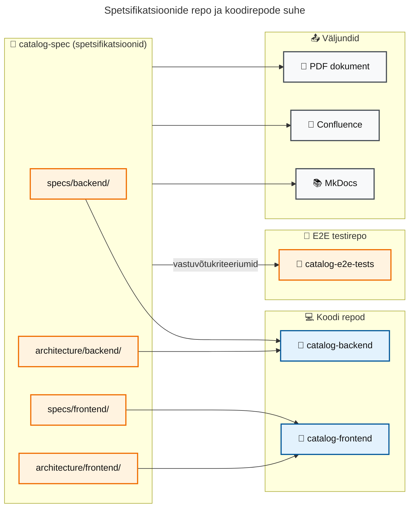

Spetsifikatsioonide repo alamkataloogid vastavad koodi repodele:

- `specs/backend/` + `architecture/backend/` → **backend repo**
- `specs/frontend/` + `architecture/frontend/` → **frontend repo**
- Vastuvõtukriteeriumid (`specs/**/*.spec.md`) → **E2E testirepo** (teststsenaariumide alus)

### Uus töövoog

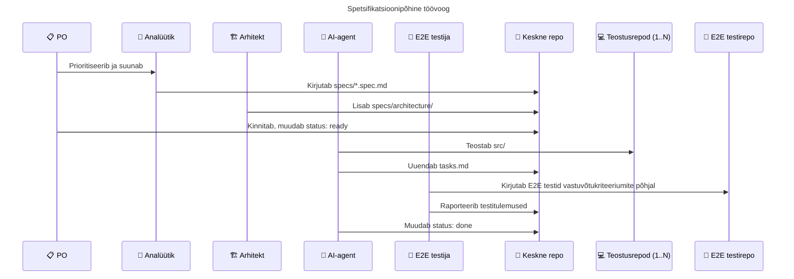

### Staatuse voog

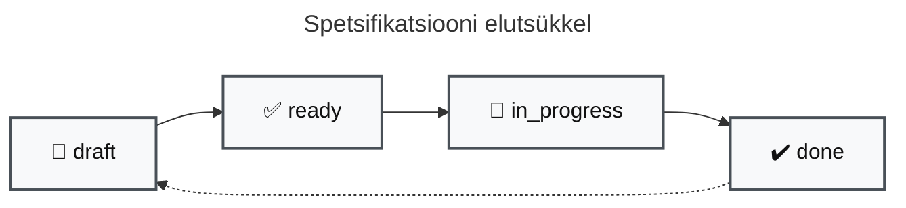

### Spetsifikatsioon (spec) ja Cursori planeerimisrežiim (Plan Mode)

Analüütiku spetsifikatsioon (spec) **ei asenda** Cursori planeerimisrežiimi (Plan Mode). Need täidavad erinevaid rolle:

| Artefakt | Omanik | Otstarve |
| :------- | :----- | :------- |
| **Spetsifikatsioon (spec)** | Analüütik / Arhitekt | Ärinõuded, vastuvõtukriteeriumid, tehniline disain — *mida* ja *miks* |
| **Planeerimisrežiimi (Plan Mode) väljund** | AI-agent + Arendaja | Konkreetne teostusplaan — *kuidas* ja *mis järjekorras* |

**Plan Mode'i sisendid:**

Plan Mode ei loe ainult spetsifikatsiooni — ta võtab arvesse kogu projektikonteksti:

| Sisend | Kaust / fail | Mida annab |
| :----- | :----------- | :--------- |
| Spetsifikatsioon (spec) | `specs/**/*.spec.md` | Ärinõuded, kasutusjuhud, vastuvõtukriteeriumid |
| Arhitektuur | `specs/architecture/**/*.md` | Tehniline disain, API-d, andmemudelid |
| Suunavad failid (steering) | `steering/*.md` | Kohustuslikud standardid ja piirangud |
| ADR-id | `adr/*.md` | Arhitektuuriotsused ja nende põhjendused |
| Cursori reeglid | `.cursor/rules/*.mdc` | Arendusnõuded, koodi stiil, mustrid |
| Olemasolev kood | `src/**/*` | Praegune teostus ja kontekst |

**Miks Plan Mode on endiselt vajalik:**

1. **Arusaamise kontroll** — Plan Mode võimaldab arendajal ja AI-agendil veenduda, et mõlemad said ülesandest ühtemoodi aru enne koodi kirjutamist
2. **Konteksti süntees** — Plan Mode ühendab spetsifikatsiooni, arhitektuuri, ADR-id ja Cursori reeglid ühtseks teostusplaaniks
3. **Äärjuhtude avastamine** — planeerimise käigus tulevad välja tehnilised nüansid, mida äriline spetsifikatsioon ei kata
4. **Samm-sammuline valideerimine** — arendaja saab plaani üle vaadata ja vajadusel korrigeerida enne teostust

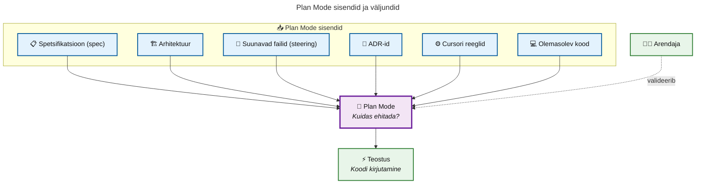

> **Soovitus:** Kasuta Plan Mode'i alati enne keerulisemate funktsionaalsuste teostamist, isegi kui spetsifikatsioon (spec) on detailne. See on viimane kontrollpunkt enne koodi kirjutamist.

## Osa 3: Mis jääb, mis muutub, mis kaob?

### Miks kasutajalood (user stories) ei kao

Levinud väärarusaam: "AI-ga pole kasutajalugusid vaja." Tegelikult:

| Kiht | Omanik | Sisu | AI roll |
| :--- | :----- | :--- | :------ |
| **Äriline spetsifikatsioon (spec)** | Analüütik | Kasutusjuhud, vastuvõtukriteeriumid | Loeb kontekstiks |
| **Tehniline spetsifikatsioon (spec)** | Arhitekt | API lepingud, piirangud, mustrid | Täidab otse |

**Miks äriline kiht jääb:**

- Ärireeglid tulevad tellijalt, mitte arhitektuurist
- Vastuvõtukriteeriumid määravad, millal töö on "valmis"
- Kasutusjuhud annavad AI-le konteksti (vähendab hallutsinatsioone)
- Jälgitavus (traceability) — audiitorid ja uued liikmed vajavad ärilist põhjendust

### Mis muutub

| Traditsiooniline agiilne lähenemine (Agile) | Spetsifikatsioonipõhine arendus |
| :------------------------------------------ | :------------------------------ |
| Kasutajalugu → Arendaja tõlgendab → Kood | Kasutajalugu → PO kinnitab → Arhitekt + AI → Tehniline spetsifikatsioon (spec) → AI → Kood → E2E testija valideerib |
| Ebaselgus lahendatakse sprindi ajal | Ebaselgus lahendatakse ENNE teostust |
| "As a user, I want..." piisab | "As a user..." → API leping + piirangud |
| Arendajad hindavad (teostuse aega) | Analüütikud ja arhitektid hindavad (spetsifikatsiooni loomise aega), AI teostab ennustatavalt |

### Mis kaob ära

| Täna | Uues lähenemises |
| :--- | :--------------- |
| Punktide (story point) hinnangud teostusele | Hinnatakse analüüsi ja arhitektuuri ajakulu, mitte teostust (vt [Mahuhinnangud](#mahuhinnangud-spetsifikatsioonipõhises-arenduses)) |
| Pikad täpsustamised (refinement) | Spetsifikatsioon (spec) on juba detailne, pole vaja "lahti rääkida" |
| Sprindi planeerimise (sprint planning) koosolekud | Spetsifikatsioon (spec) on juba "valmis" (ready), AI alustab kohe |
| 8-10 inimese meeskond | 4-5 inimese meeskond (PO, analüütik, arhitekt, 1-2 arendajat, E2E testija) |
| ~12h koosolekuid nädalas | ~2-3h nädalas |
| Dokumentatsiooni uuendamine käsitsi | Spetsifikatsioon (spec) = dokumentatsioon, uueneb töö käigus |
| Confluence/Word/EA sünkroniseerimine | Üks repo, üks tõde |
| Jira ruumid per komponent | Üks Jira ruum + tasks.md (komponentide jälgimine Jira komponendi funktsionaalsusega) |

## Struktuur

### Spetsifikatsioonide repo (keskne süsteemirepo)

```text
catalog-spec/
├── specs/                           # Ärinõuded (spetsifikatsioonid)
│   ├── *.spec.md                   # Lihtsamate projektide puhul otse siin
│   │
│   ├── {alamdomeen}/               # VÕI domeenipõhine jaotus (suuremad projektid)
│   │   ├── *.spec.md              # Domeenispetsiifilised spec-id
│   │   └── readme.md              # Alamdomeeni ülevaade
│   │
│   └── architecture/               # Tehniline disain (Arhitekt)
│       ├── backend/
│       │   ├── overview.md
│       │   └── {moodul}.md
│       └── frontend/
│           ├── overview.md
│           └── {komponent}.md
├── adr/                            # Arhitektuuriotsuste logid
│   ├── 001-{otsus}.md
│   └── 002-{otsus}.md
├── contracts/                      # API lepingud (OpenAPI, AsyncAPI)
│   └── catalog-api.yaml
├── steering/                       # Läbivad standardid
│   ├── component-standards.md
│   ├── security.md
│   ├── integration.md
│   └── observability.md
├── tasks.md                        # Backlog (spec olemas)
├── todo.md                         # Tulevikuideed (spec puudub)
└── README.md                       # Projekti ülevaade
```

### Koodirepo(d) (eraldi!)

```text
backend-repo/                       # Eraldi Git repo
├── src/
│   ├── main/
│   └── test/
├── pom.xml / build.gradle
├── AGENTS.md                       # AI-agendi operatiivne kontekst
└── README.md

frontend-repo/                      # Eraldi Git repo
├── src/
│   ├── components/
│   └── pages/
├── package.json
├── AGENTS.md                       # AI-agendi operatiivne kontekst
└── README.md

e2e-tests-repo/                     # Eraldi Git repo E2E testidele
├── tests/
│   ├── smoke/                     # "Smoke testid" (kiire tervisekontroll)
│   ├── regression/                # Regressioonitestid
│   └── e2e/                       # "End-to-end" stsenaariumid
├── fixtures/                       # Testandmed ja seadistused
├── playwright.config.ts            # Testimisraamistiku konfiguratsioon
├── AGENTS.md                       # AI-agendi kontekst testide jaoks
└── README.md
```

**Oluline:** Spetsifikatsioonide repo (nt `catalog-spec`), koodirepo(d) ja E2E testirepo on **eraldi Git repositooriumid**. Spetsifikatsioonide repo on "tõe allikas" ärinõuete ja arhitektuuri jaoks, koodirepo(d) sisaldavad teostust ning E2E testirepo sisaldab läbivaid kvaliteediteste.

### Alamdomeenide näide (suuremad projektid)

```text
specs/
├── readme.md                       # Spetsifikatsioonide (spec) indeks UC arvudega
├── dashboard/                      # Dashboard alamdomeen
│   ├── readme.md                  # Alamdomeeni ülevaade
│   ├── metrics.spec.md            # Koondinäitajad
│   ├── visualizations.spec.md     # Graafikud
│   └── search.spec.md             # Kiirotsing
├── scanner/                        # Scanner alamdomeen
│   ├── readme.md
│   ├── discovery.spec.md          # Repode avastamine
│   ├── analysis.spec.md           # Tehnoloogiate tuvastamine
│   └── scoring.spec.md            # Tervisehinne
├── api/                            # API alamdomeen
│   ├── readme.md
│   ├── search-api.spec.md
│   └── data-api.spec.md
└── architecture/                   # Tehniline disain (muutumatu)
    ├── backend/
    └── frontend/
```

**Millal kasutada alamdomeene:**

- Projektis on 10+ spetsifikatsiooni (spec)
- On selged piiritletud kontekstid või alamdomeenid (nt scanner, dashboard, API)
- Mitu analüütikut töötavad paralleelselt
- Spetsifikatsioonid (spec) viitavad üksteisele rohkem domeeni sees kui vahel

### Failide omanikud

| Fail | Omanik | Otstarve | AI kasutab |
| :--- | :----- | :------- | :--------- |
| `specs/**/*.spec.md` | Analüütik (PO kinnitab) | Ärinõuded (spetsifikatsioonid), UC-d, kriteeriumid | Kontekstiks |
| `specs/**/readme.md` | Analüütik | Alamdomeeni ülevaated, indeksid | Kontekstiks |
| `specs/architecture/**/*.md` | Arhitekt | Tehniline disain, API-d, piirangud | ✅ Peamine |
| `steering/*.md` | Arhitekt | Projektitaseme reeglid | ✅ Alati |
| `adr/*.md` | Arhitekt | Läbivad arhitektuuriotsused | ✅ Viitena |
| `contracts/*.yaml` | Arhitekt | API lepingud (OpenAPI) | ✅ Rangelt |
| `tasks.md` | PO (prioritiseerib) / AI-agent (uuendab) | Backlog (spec olemas) | ✅ Loeb ja uuendab |
| `todo.md` | AI-agent | Tulevikuideed (spec puudub) | ✅ Loeb ja uuendab |
| `e2e-tests/**/*` | E2E testija | "End-to-end" testid, "smoke testid", regressioonitestid | Kontekstiks + genereerib |

> **Põhimõte:** PO prioritiseerib ja kinnitab *mida* ehitada. Analüütik kirjutab *mida* ja *miks* (inimloetav). Arhitekt teisendab selle *kuidas*-ks (AI-täidetav). E2E testija valideerib *kas* tulemus vastab kriteeriumidele. AI kasutab `specs/architecture/` + `steering/` + `contracts/`, võttes `specs/**/*.spec.md` äriliseks kontekstiks.

### Suunavad failid (steering)

Projektitaseme piirangud, mida AI peab alati järgima:

| Fail | Sisu |
| :--- | :--- |
| `steering/component-standards.md` | Teenuste nimed, API versioonid, DB skeemid |
| `steering/security.md` | Autentimine, OIDC, saladuste haldus |
| `steering/integration.md` | REST/OpenAPI standardid, välissüsteemid |

**Erinevus ADR-st:** Suunavad failid (steering) = kohustuslikud reeglid. ADR = otsuse dokumentatsioon (miks nii tehti).

### AGENTS.md (koodirepodes)

`AGENTS.md` asub **koodirepodes** ja annab AI-agendile operatiivse konteksti: kuidas käivitada serverit, marsruutide tabel, levinud töövood, selektorid testideks jne. See on teostusespetsiifiline info, mis ei kuulu spetsifikatsioonide reposse.

> **Põhimõte:** Spetsifikatsioonide repo ütleb *mida* ehitada. Koodirepo `AGENTS.md` ütleb *kuidas* töötada.

### ADR-d (arhitektuuriotsuste kirjed / Architecture Decision Records)

Olulised arhitektuuriotsused talletatakse `adr/` kausta:

```text
adr/
├── 001-jooq-over-jpa.md
├── 002-redis-pubsub.md
└── 003-api-versioning.md
```

**Millal luua ADR:**

- Kaldutakse kõrvale arhitektuurist
- Uus läbiv muster (nt "kõik teenused vajavad kaitselülitit (circuit breaker)")
- Tehnoloogiavalik (nt "ClickHouse, mitte TimescaleDB")
- Turvalahendus (nt "väljatasemel krüpteerimine PII jaoks")
- **Keskse reegli ülekirjutamine** — kui konkreetses projektis on põhjendatud erand suunavast reeglist (steering)

ADR-i staatused: `proposed` → `accepted` → `deprecated` / `superseded`

> **Näide:** Kui `steering/security.md` nõuab JWT autentimist, aga konkreetne süsteem vajab mTLS-i, siis luuakse ADR, mis dokumenteerib erandi ja selle põhjenduse. ADR viitab suunavale reeglile, mida ta üle kirjutab.

## Cursor tööruum (workspace) seadistus arendajale

Kuna spetsifikatsioonide repo ja koodirepo(d) on eraldi Git repositooriumid, tuleb need Cursoris ühendada ühte tööruumi.

### Seadistamine

1. **Klooni repod kõrvuti:**

   ```text
   ~/projects/
   ├── catalog-spec/         # Spetsifikatsioonide repo (specs, architecture, steering)
   ├── catalog-backend/      # Backend koodirepo
   ├── catalog-frontend/     # Frontend koodirepo
   └── catalog-e2e-tests/    # E2E testirepo
   ```

2. **Ava Cursoris koodirepo** (nt `catalog-backend`)

3. **Lisa spetsifikatsioonide repo tööruumi (workspace):**
   - `File` → `Add Folder to Workspace...`
   - Vali `catalog-spec` kaust

4. **Salvesta tööruum (workspace)** (valikuline):
   - `File` → `Save Workspace As...`
   - Nt `catalog-backend.code-workspace`

### Miks see töötab

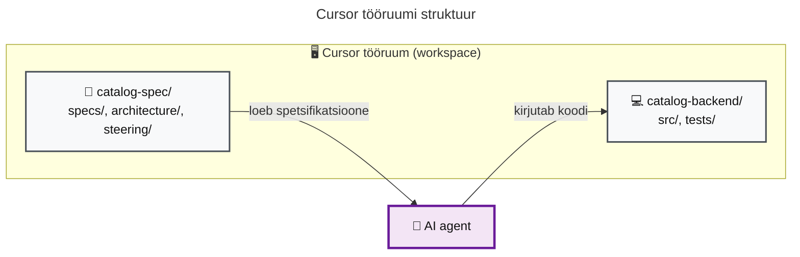

**Eelised:**

- Agent näeb **nii spetsifikatsioone (spec) kui koodi** ühes kontekstis
- Saad öelda: `@specs/dashboard.spec.md implementeeri UC-DASH-1`
- Agent järgib automaatselt `steering/` reegleid
- Sissekanded (commit) lähevad **õigesse reposse** (kood koodireposse, spetsifikatsiooni (spec) muudatused spetsifikatsioonide reposse)

### Skaleerumine mitme koodirepoga

Sama lähenemine töötab olenemata koodirepode arvust:

| Stsenaarium | Tööruumi (workspace) sisu |
| :---------- | :------------------------ |
| Üks monoliit | `analysis/` + `app/` + `e2e-tests/` |
| Backend + Frontend | `analysis/` + `backend/` + `frontend/` + `e2e-tests/` |
| Mikroteenused | `analysis/` + `service-a/` + `service-b/` + `e2e-tests/` |

**Näide mikroteenuste puhul:**

```text
~/projects/
├── catalog-spec/               # Üks keskne spetsifikatsioonide repo
├── catalog-user-service/       # Mikroteenuse repo 1
├── catalog-payment-service/    # Mikroteenuse repo 2
├── catalog-notification-svc/   # Mikroteenuse repo 3
└── catalog-e2e-tests/          # E2E testirepo (ühine kõigile teenustele)
```

Cursoris avad ühe mikroteenuse ja lisad spetsifikatsioonide repo. Kui liigud teise mikroteenuse juurde, avad uue tööruumi sama spetsifikatsioonide repoga.

> **Vihje:** Loo iga mikroteenuse jaoks eraldi `.code-workspace` fail, mis sisaldab seda teenust + spetsifikatsioonide repo. Nii on kiire vahetada konteksti.

## Kuidas Cursor IDE toetab iga rolli

Cursor ei ole lihtsalt koodiredaktor — see on AI-assistent, mis tunneb kogu repositooriumi konteksti.

### PO (Product Owner)

| Võimalus | Kasu |
| :------- | :--- |
| **Backlog'i ülevaade** | Küsi: "Millised spetsifikatsioonid on draft staatuses?" — AI annab kogu ülevaate |
| **Prioritiseerimine** | Küsi: "Millised UC-d on kõige suurema ärimõjuga?" — AI aitab analüüsida |
| **Edenemise jälgimine** | Küsi: "Kui palju spetsifikatsioone on done vs in_progress?" — AI loeb tasks.md ja metaandmed kokku |
| **Kinnitamine** | Vaata üle analüütiku spetsifikatsioon ja muuda staatus "ready" — AI aitab valideerida terviklikkust |
| **Sõltuvuste tuvastamine** | Küsi: "Millised UC-d sõltuvad UC-DASH-1 valmimisest?" — AI leiab ristviited |

### Analüütik

| Võimalus | Kasu |
| :------- | :--- |
| **Vestlus kogu dokumentatsiooniga** | Küsi: "Kas meil on juba sarnane UC kusagil?" — AI leiab üles |
| **Ristanalüüs** | Küsi: "Millised spetsifikatsioonid (spec) viitavad autentimisele?" — näeb seoseid |
| **Muudatuste mõjuanalüüs** | Muudad ühe spetsifikatsiooni (spec) → AI ütleb, milliseid teisi see mõjutab |
| **Valideerimise tugi** | "Kas see spetsifikatsioon (spec) katab kõik vastuvõtukriteeriumid?" — AI kontrollib |
| **Ei jää midagi kahe silma vahele** | AI näeb tervet repo, mitte ainult avatud faili |

### Arhitekt

| Võimalus | Kasu |
| :------- | :--- |
| **Arhitektuuri vastavuskontroll** | "Kas see disain vastab steering/security.md nõuetele?" |
| **ADR-de genereerimine** | "Loo ADR selle otsuse kohta" — AI vormistab õigesse formaati |
| **API lepingute valideerimine** | "Kas contracts/catalog-api.yaml vastab spetsifikatsiooni (spec) nõuetele?" |
| **Mustrite järjepidevus** | "Kas see komponent järgib sama mustrit mis teised?" |
| **Tehnilise disaini täiendamine** | AI soovitab puuduvaid aspekte (veakäsitlus (error handling), vahemälu (caching) jne) |

### Arendaja / AI-agent

| Võimalus | Kasu |
| :------- | :--- |
| **Selge sisend agendile** | `@specs/dashboard.spec.md` + `@specs/architecture/frontend/` → agent teab täpselt mida teha |
| **Testide genereerimine** | "Loo testid UC-DASH-1 vastuvõtukriteeriumite põhjal" |
| **Suunavate failide (steering) järgimine** | Agent loeb automaatselt `steering/` ja järgib reegleid |
| **Koodi ja spetsifikatsiooni (spec) sünkroonis hoidmine** | Agent uuendab `tasks.md` staatust töö käigus |
| **Refaktoreerimine turvalises kontekstis** | Agent teab, milliseid teisi komponente muudatus mõjutab |

### E2E testija

| Võimalus | Kasu |
| :------- | :--- |
| **Teststsenaariumide genereerimine** | `@specs/dashboard.spec.md` → AI genereerib "end-to-end" teststsenaariumid vastuvõtukriteeriumite põhjal |
| **Regressioonitestide täiendamine** | Uue UC lisamisel küsi: "Millised regressioonitestid vajavad uuendamist?" — AI analüüsib mõju |
| **Testide ja spetsifikatsiooni (spec) ristvalideerimine** | "Kas kõik vastuvõtukriteeriumid on testidega kaetud?" — AI võrdleb spec ja teste |
| **Testandmete genereerimine** | "Loo "fixtures" UC-DASH-1 jaoks" — AI genereerib sobivad testandmed |
| **"Smoke testide" loomine** | "Loo "smoke testid" kriitiliste kasutajateede jaoks" — AI tuvastab kriitilised vood |

### Kokkuvõte: AI kui meeskonnaliige

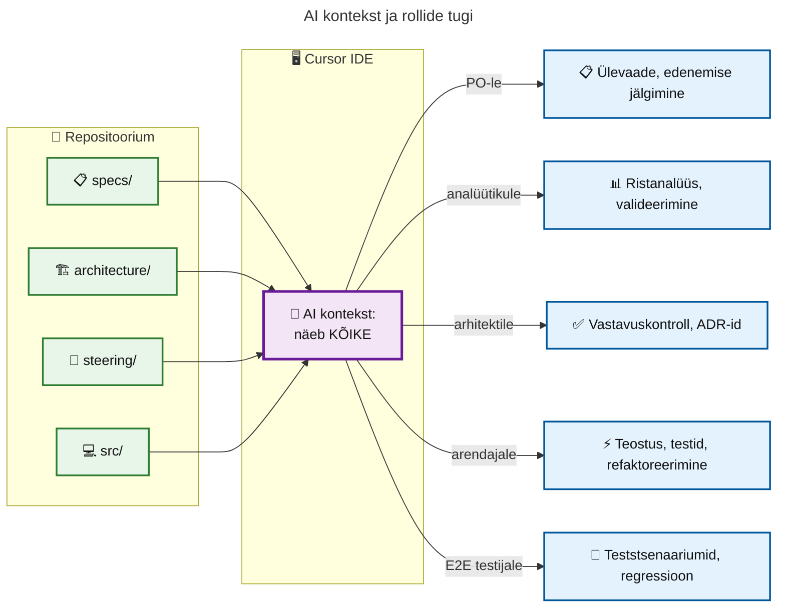

**Põhiline erinevus:** Traditsiooniliselt peab iga roll ise meeles pidama, mida teised on teinud. Cursoriga on AI see, kes "mäletab" kogu konteksti ja aitab iga rolli oma vaatenurgast.

## Parimad praktikad

### See EI OLE koskmudel (waterfall)

Levinud väärarusaam on, et spetsifikatsioonipõhine arendus tähendab "kõigepealt kirjuta kõik valmis, siis hakka kodeerima". **See pole tõsi.** Spetsifikatsioonipõhine arendus on iteratiivne protsess, kus:

- Spetsifikatsioon (spec) on **elav dokument**, mis areneb koos projektiga
- Alusta minimaalse spetsifikatsiooniga ja täienda vastavalt õpitule
- Iga iteratsioon võib tuua uusi nõudeid, mis lisatakse spetsifikatsiooni
- Spetsifikatsioon ei pea olema "täiuslik" enne teostust — piisab, kui see on "piisavalt hea" järgmise sammu jaoks

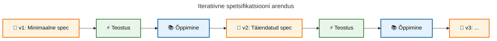

**Erinevus koskmudelist:**

- Koskmudel: Spec → Disain → Kood → Test → Valmis (lineaarne, tagasipöördumine kallis)
- Spetsifikatsioonipõhine: Spec ↔ Disain ↔ Kood ↔ Test (iteratiivne, muudatused odavad)

### Paralleelne planeerimine Git harude abil

Analüütik ja arhitekt saavad **töötada järgmise versiooni kallal** samal ajal, kui AI-agent teostab praegust versiooni. See võimaldab pidevat planeerimist ilma arendust segamata.

**Soovitatav harude struktuur:**

| Haru | Otstarve | Omanik |
| :--- | :------- | :----- |
| `main` | Stabiilne spetsifikatsioon, mille põhjal AI-agent teostab | Arhitekt (kinnitab) |
| `develop` | Pooleliolev planeerimine järgmise versiooni jaoks | Analüütik, Arhitekt |
| `feature/*` | Konkreetse funktsionaalsuse spetsifikatsioon | Analüütik |

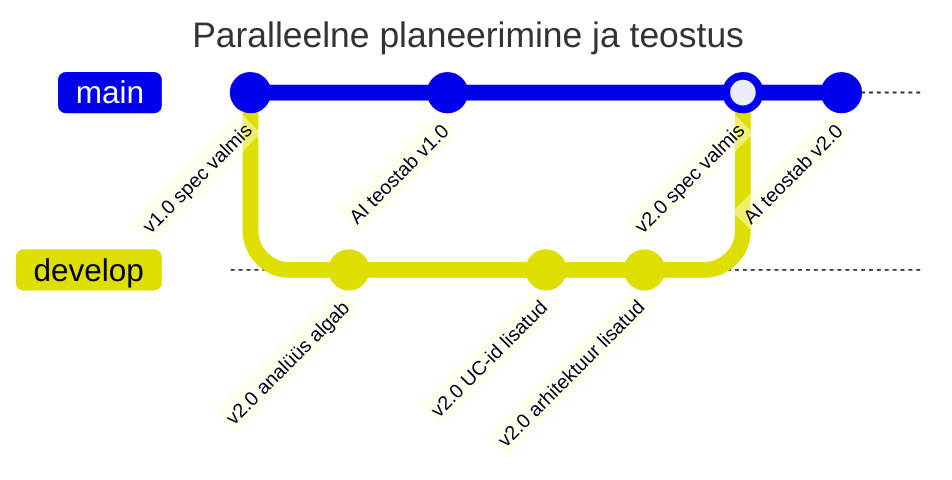

**Töövoog:**

1. **main haru** sisaldab kinnitatud spetsifikatsiooni, mille põhjal AI-agent töötab
2. **develop haru** on analüütiku ja arhitekti "töölaud", kus nad valmistavad ette järgmist versiooni
3. Kui uus versioon on valmis ja üle vaadatud, liidetakse see `main` harusse
4. AI-agent alustab uue versiooni teostamist

**Eelised:**

- Analüütik ei pea ootama, kuni AI-agent lõpetab — ta saab juba järgmist versiooni planeerida
- Arendus ja planeerimine toimuvad paralleelselt
- Selge eraldus: "mida praegu ehitatakse" vs "mida järgmisena ehitatakse"
- Versiooniajalugu säilib — saab alati vaadata, milline spetsifikatsioon oli mingi hetkel kehtiv

### Spetsifikatsioonide (spec) kvaliteet

| Põhimõte | Selgitus |
| :------- | :------- |
| **Inimloetavus ennekõike** | Kui spetsifikatsioon (spec) on liiga pikk, et seda läbi lugeda ja valideerida, on funktsionaalsus (feature) liiga suur |
| **Maksimaalne pikkus ~500 rida** | Pikemad spetsifikatsioonid kaotavad fookuse ja AI-l tekib "keskelt kaduma" probleem |
| **Alusta minimaalselt** | Ära kirjuta ette kõiki tulevikujuhtumeid — lisa detaile vastavalt vajadusele |
| **Spetsifikatsioon (spec) on elus dokument** | Spetsifikatsioon peab arenema koos projektiga, mitte jääma algversiooniks |

### Iteratiivne valideerimine

Iga faasi lõpus **peatu ja valideeri** enne järgmisse liikumist:

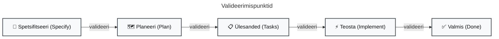

**Küsimused valideerimiseks:**

- Kas spetsifikatsioon (spec) kajastab seda, mida tegelikult tahame ehitada?
- Kas plaan arvestab reaalsete piirangutega?
- Kas on äärjuhte, mida AI jättis märkamata?
- Kas ülesanded on piisavalt väikesed, et neid eraldi testida?

### Mahuhinnangud spetsifikatsioonipõhises arenduses

Traditsioonilised "story point" hinnangud ja sprindipõhine mahuarvestus kaovad, kuid **ajakulu ei kao**. Muutub see, **kuhu** aeg kulub. Koodi kirjutamine on AI-agendiga kiire, aga kvaliteetne analüüs, arhitektuur ja agendi juhtimine nõuavad endiselt inimese aega.

**Põhimõte:** "Odav teostus" ei tähenda "kiire projekt". Analüüs ja arhitektuur on investeering, mis määrab AI-agendi väljundi kvaliteedi.

**Kus aeg tegelikult kulub:**

| Tegevus | Kes | Mida sisaldab |
| :------ | :-- | :------------ |
| Analüüs ja spetsifitseerimine | Analüütik, PO | UC-de defineerimine, vastuvõtukriteeriumid, ärireeglite selgitamine, sidusrühmade kaasamine |
| Arhitektuur ja tehniline disain | Arhitekt | API lepingud, andmemudelid, piirangud, ADR-id, suunavad failid (steering) |
| AI-agendi juhtimine | Arendaja | Planeerimisrežiim (Plan Mode), valideerimine, paranduste suunamine, konteksti haldus |
| E2E testimine | E2E testija | Teststsenaariumide loomine, regressioonitestid, "smoke testid" |
| Ülevaatus ja kinnitamine | PO, Arhitekt | Spetsifikatsiooni (spec) ülevaatus, staatuse muutmine, kvaliteedikontroll |

**Traditsiooniline vs spetsifikatsioonipõhine ajakulu jaotus:**

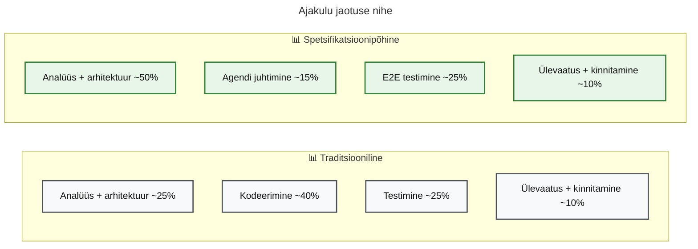

> **NB:** Protsendid on illustratiivsed ja sõltuvad projekti iseloomust. Oluline on trend: aeg nihkub **kodeerimiselt analüüsi, arhitektuuri ja kvaliteedikontrolli suunas**.

**Juhised hinnangu andmiseks:**

- **Hinda analüüsi ja arhitektuuri eraldi** — need on suurimad ajakulud ja neid ei tohi kokku suruda ühe "arendus" sildi alla
- **Agendi juhtimine ei ole null** — isegi hea spetsifikatsiooni korral kulub aega planeerimisrežiimile (Plan Mode), väljundi valideerimisele ja paranduste suunamisele
- **E2E testimine vajab eraldi hinnangut** — testija ei saa alustada enne, kui teostus on piisavalt valmis; see lisab sõltuvuse
- **Iteratsioon on osa hinnangust** — esimene versioon pole kunagi lõplik; arvesta spetsifikatsiooni täiendamise ja korduvate tsüklite aega
- **Kalibreerumine aja jooksul** — jälgi tegelikku ajakulu ja korrigeeri hinnanguid järgmisteks iteratsioonideks

**Soovitused alustamiseks:**

1. Esimeste funktsionaalsuste puhul ära anna kindlaid hinnanguid — jälgi tegelikku ajakulu
2. Pärast 2-3 iteratsiooni tekib meeskonnal tunnetus, kui palju aega iga faas tegelikult võtab
3. Kasuta lihtsat ajajälgimist faaside kaupa (analüüs, arhitektuur, agendi juhtimine, testimine)
4. Ära võrdle otse traditsioonilise arenduse hinnangutega — kontekst on teistsugune

### Testid kui spetsifikatsiooni kontroll

AI-agent **peab** kirjutama vähemalt:

- ühiktestid (unit tests) — komponentide/funktsioonide loogika kontroll
- integratsioonitestid (integration tests) — kihtide ja teenuste koostoime kontroll

E2E testija **lisab** eraldi testireposse:

- "end-to-end" testid — kasutajateede läbimine (browser-based)
- "smoke testid" — kriitiliste voogude kiire tervisekontroll pärast "deployment'i"
- regressioonitestid — tagab, et uued muudatused ei riku olemasolevat funktsionaalsust

**Oluline:** kõigi testide sisu peab tulenema spetsifikatsiooni (spec) vastuvõtukriteeriumidest (acceptance criteria). E2E testija kasutab sama spetsifikatsiooni, et luua teststsenaariumid, mis katavad kasutajateed otsast lõpuni.

### Cursori reeglid (.mdc failid)

Cursori reeglid (Cursor Rules) on `.cursor/rules/` kaustas asuvad `.mdc` failid, mis juhendavad AI agenti automaatselt. Need kehtivad **kõigile rollidele** ja aitavad hoida järjepidevust.

| Reegli tüüp | Millal rakendub | Kasutus |
| :---------- | :-------------- | :------ |
| **Alati (Always)** | Iga vestlus | Üldised projekti standardid (keel, formaat) |
| **Automaatne (Auto, globs)** | Kui töötad kindla failimustriga | `specs/**/*.spec.md` → spetsifikatsiooni (spec) kirjutamise juhised |
| **Agendi otsustatud (Agent-decided)** | AI otsustab kirjelduse põhjal | Spetsiifilised mustrid (nt API disain) |
| **Käsitsi (Manual)** | Kui kasutaja viitab @-ga | Harva kasutatavad, kuid olulised reeglid |

**Näited rollide kaupa:**

| Roll | Reegli näide | Glob muster |
| :--- | :----------- | :---------- |
| PO | Spetsifikatsiooni (spec) staatuse haldus, prioriteedi märkimine | `specs/**/*.spec.md`, `tasks.md` |
| Analüütik | Spetsifikatsiooni (spec) struktuur, UC nimetamine, metaandmed (frontmatter) | `specs/**/*.spec.md` |
| Arhitekt | API lepingute formaat, ADR struktuur | `specs/architecture/**/*.md`, `adr/*.md` |
| Arendaja | Koodi stiil, testide nõuded, sissekande (commit) sõnumid | `src/**/*.ts`, `src/**/*.vue` |
| E2E testija | Teststsenaariumide struktuur, nimetamine, "fixtures" | `tests/**/*.spec.ts`, `tests/**/*.test.ts` |

**Soovitused:**

- Hoia reeglid lühikesed (< 50 rida) ja fokuseeritud
- Lisa reeglisse nii hea kui halva näide — AI õpib paremini
- Loo reegleid orgaaniliselt: kui AI teeb korduvalt sama vea, loo reegel
- Konsolideeri sarnased reeglid ühte faili, kui neid koguneb palju

> **Näide:** Kui analüütik unustab pidevalt metaandmeid (frontmatter) lisada, loo reegel `spec.mdc` globiga `specs/**/*.spec.md`, mis tuletab meelde staatuse ja prioriteedi lisamist.

### Levinud vead (antimustrid / anti-patterns)

| Viga | Miks see kahjulik |
| :--- | :---------------- |
| **Spetsifikatsiooniteater (spec-teater)** | Kirjutatakse detailsed spetsifikatsioonid, mida keegi ei loe ega valideeri |
| **Ennatlik kõikehõlmavus** | Proovitakse kohe kõike ette spetsifitseerida, selle asemel et iteratiivselt täiendada |
| **Spetsifikatsiooni (spec) ja koodi lahknemine** | Spetsifikatsioon vananeb, kood areneb — tekib "kaks tõde" |
| **AI-genereeritud pundunud spetsifikatsioon** | AI toodab pikki spetsifikatsioone, mida keegi ei redigeeri kompaktsemaks |
| **Äärjuhtude eiramine** | Spetsifikatsioone analüüsitakse eraldi, unustades et funktsionaalsused (features) mõjutavad üksteist |

### Rollipõhised soovitused

| Roll | Tee nii | Ära tee nii |
| :--- | :------ | :---------- |
| **PO** | Kinnita spec staatus "ready" alles pärast ülevaatust | Ära kiirusta kinnitamisega ilma valideerimata |
| **PO** | Prioritiseeri äriväärtuse põhjal, hoia `tasks.md` ajakohasena | Ära dubleeri tööde nimekirja Jirasse ja tasks.md-sse |
| **Analüütik** | Keskendu ärinõuetele, kirjuta mõõdetavad vastuvõtukriteeriumid | Ära lisa tehnilist lahendust ega jäta nõudeid ebamääraseks |
| **Analüütik** | Kasuta järjekindlat UC nimetust (`UC-DASH-1`), viita seotud spec-idele | Ära dubleeri sisu spetsifikatsioonide vahel |
| **Arhitekt** | Loo arhitektuur `specs/architecture/` kausta, lisa API lepingud näidetega | Ära kirjuta üle analüütiku spec-faile ega jäta liideseid ebamääraseks |
| **Arhitekt** | Viita ADR-dele, uuenda spec staatus "ready" kui valmis | Ära jäta spetsifikatsioone "draft" limbosse |
| **Arendaja** | Loe läbi nii spec kui arhitektuuridokument, kasuta Plan Mode'i | Ära hüppa otse teostusse ega leiuta oma liideseid |
| **Arendaja** | Uuenda `tasks.md`, viita UC numbritele sissekandesõnumites | Ära jäta ülesandeid märkimata |
| **E2E testija** | Tuleta teststsenaariumid spec vastuvõtukriteeriumidest, viita UC numbritele | Ära kirjuta teste "tunnetuse" põhjal |
| **E2E testija** | Hoia testid eraldi E2E testirepos, uuenda regressiooniteste | Ära sega "end-to-end" teste ühiktestidega |

## Rollide kokkuvõte

- **PO**: prioritiseerib `tasks.md`, kinnitab spetsifikatsioonide (spec) staatuse "ready", jälgib edenemist
- **Analüütik**: kirjutab `specs/*.spec.md`, määrab UC-d ja kriteeriumid
- **Arhitekt**: lisab `specs/architecture/`, määrab API-d ja piirangud, loob ADR-e
- **AI-agent**: teostab `src/`, uuendab `tasks.md`, lõpetab spetsifikatsiooni (spec) staatuse
- **E2E testija**: kirjutab "end-to-end", "smoke" ja regressioonitestid eraldi testireposse vastuvõtukriteeriumite põhjal

### Analüütiku spetsifikatsioon (spec) sisaldab

- äriline taust ja probleem
- kasutusjuhud / kasutajalood (user stories)
- vastuvõtukriteeriumid
- protsessivoog või diagramm
- viited seotud spetsifikatsioonidele (spec)

### Näide: spetsifikatsioonifaili (spec) struktuur

```markdown
---
status: draft
priority: high
---

# Dashboard Specification (Töölaua spetsifikatsioon)

## Overview (Ülevaade)

Dashboard provides a quick overview of the organization's software catalog
status and key metrics.

## User Personas (Kasutajapersoonad)

| Persona | Goal |
|---------|------|
| Chief Architect | Technical debt overview, identifying problem areas |
| Team Lead | Monitoring team repos and compliance |
| Developer | Finding components, understanding the landscape |

## Use Cases (Kasutusjuhud)

### UC-DASH-1: View Summary (Koondi vaatamine)

**Actor**: Authenticated user
**Trigger**: User opens the dashboard

**Displays:**
- Total repository count
- Average health score
- README compliance percentage

**Acceptance Criteria (Vastuvõtukriteeriumid):**
- [ ] All summary metrics are displayed on page load
- [ ] Metrics update after scanning
- [ ] Loading state is visible

## Non-Functional Requirements (Mittefunktsionaalsed nõuded)

| Requirement | Target |
|-------------|--------|
| Page load time | < 2 seconds |
| Data freshness | Updates after scan |

## Related (Seotud)

- [search.spec.md](search.spec.md) — Search functionality
- [visualizations.spec.md](visualizations.spec.md) — Charts and graphs
```

**Võtmepunktid:**

- "Frontmatter" (`status`, `priority`) — staatuse jälgimiseks
- UC nimetamine (`UC-DASH-1`) — viitamiseks koodis ja testides
- "Acceptance Criteria" märkeruutudena — saab märkida "tehtud"
- "Related" sektsioon — jälgitavus (traceability)

## Valikuline: piletihaldus (issue-tracker)

Soovi korral võib spetsifikatsiooni (spec) metaandmed (frontmatter) sisaldada `issue_id`, `issue_url`, `last_synced`. Töövoog toimib ka ilma selleta.

## Linkimise parimad praktikad

### Eelista standardset Markdown linki

Kasuta alati **tavalist Markdown linki**, sest see töötab GitHubis, GitLabis, Cursoris ja muudes editorites:

```markdown
[Search Spec](specs/search.spec.md)
[Backend Overview](specs/architecture/backend/overview.md)
[API Contract](contracts/catalog-api.yaml)
```

### Viita konkreetsele sektsioonile

Pealkirja viide teeb seose täpseks:

```markdown
[Vastuvõtukriteeriumid (Acceptance Criteria)](specs/search.spec.md#acceptance-criteria)
```

### Kasuta „Seotud (Related)" plokki

Iga spetsifikatsioon (spec) või arhitektuurifail võiks lõppeda seotud viidetega:

```markdown
## Seotud (Related)

- [search-api.spec.md](search-api.spec.md) — API lepingud
- [architecture/backend/search.md](architecture/backend/search.md) — backend disain
```

### Lisa semantikat metaandmetesse (frontmatter)

Kui vaja masinloetavat seost, kasuta lihtsat metaandmete skeemi:

```yaml
---
id: SPEC-SEARCH
type: spec
domain: search
related:
  - SPEC-SEARCH-API
  - ARCH-BE-SEARCH
---
```

### Hoia UC-id ühtse mustriga

Kasutusjuhud olgu alati stabiilsete ID-dega:

```markdown
### UC-SEARCH-3: Filtreeri tehnoloogiapinu järgi (Filter by tech stack)
```

### Väldi wiki-linke tootmiskoodis

`[[wikilink]]` süntaks on mugav Obsidianis, kuid **ei tööta** standardsetes Git repo vaadetes. Kui vaja, kasuta wiki-linke ainult isiklikes märkmetes.
