# Spetsifikatsioonipõhine arendus

Spetsifikatsioonipõhine arendus (spec-driven development) on tarkvaraarenduse lähenemine, kus detailsed spetsifikatsioonid (spec) on esmane sisend AI-agentidele koodi genereerimiseks. Selle asemel, et arendaja tõlgendaks ebamääraseid nõudeid, kirjutavad analüütikud ja arhitektid täpsed, masinloetavad spetsifikatsioonid, mille põhjal AI-agent teostab koodi ennustatavalt ja järjepidevalt. See lähenemine vähendab tõlgendusvigasid, kiirendab arendust ja tagab, et dokumentatsioon püsib koodiga alati sünkroonis.

## Miks mitte lihtsalt "vibe coding"?

AI-agentidega arendamisel on kiusatus lihtsalt öelda: "Tee mulle autentimissüsteem" ja loota, et agent teeb õige asja. Seda nimetatakse **"vibe coding"** ehk tunnetuspõhiseks kodeerimiseks — kiire prototüüpimine, kus AI arvab ära, mida sa tahad.

| Lähenemine | Sobib | Ei sobi |
| :--------- | :---- | :------ |
| **Vibe coding** | Kiired prototüübid, eksperimendid, ühekordsed skriptid | Tootmissüsteemid, meeskonnatöö, pikaajaline hooldus |
| **Spetsifikatsioonipõhine arendus** | Tootmissüsteemid, meeskonnatöö, auditeeritavus | Kiired katsetused, kus tulemus pole kriitiline |

**Vibe coding'u probleemid:**

- AI teeb mõistlikke oletusi, aga mõned neist on valed — ja sa avastad selle alles hiljem
- Puudub jagatud arusaam meeskonnas — iga arendaja saab erineva tulemuse
- Arhitektuuriotsused lukustuvad koodi, mitte dokumentatsiooni
- Raske hiljem muuta, sest "miks nii tehti" pole kusagil kirjas
- **Kiirus peidab probleeme** — AI genereerib koodi nii kiiresti, et vigased oletused jõuavad tootmisesse enne, kui keegi jõuab neid märgata

**Spetsifikatsioonipõhine arendus lahendab need probleemid:**

- Spetsifikatsioon (spec) on jagatud tõe allikas, mida kõik loevad
- AI-agent ei arva — ta täidab täpselt seda, mis on kirjas
- Arhitektuuriotsused on dokumenteeritud ja ülevaadatavad
- Muudatused algavad spetsifikatsioonist, mitte koodist

> **Põhimõte:** Kood ei ole parim koht nõuete läbirääkimiseks. Spetsifikatsioon on.

## Osa 1: Probleem täna

Praegune töökorraldus on killustunud: info ja "tõde" elavad Confluence'is, Jira piletites, Wordi failides, Enterprise Architecti joonistes, koosolekute memodes ning eraldi Git/Bitbucket repos.

### Kus info tegelikult elab

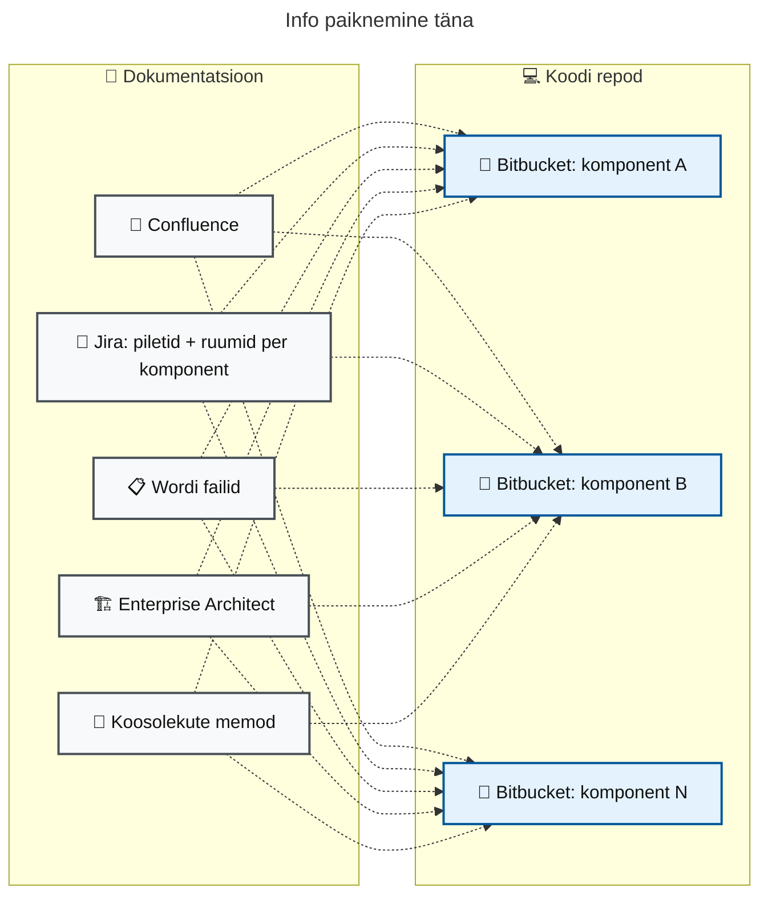
```mermaid
---
title: Info paiknemine täna
---
flowchart LR
    subgraph Docs["📄 Dokumentatsioon"]
        CF["📝 Confluence"]
        JR["🎫 Jira: piletid + ruumid per komponent"]
        WD["📋 Wordi failid"]
        EA["🏗️ Enterprise Architect"]
        MM["📅 Koosolekute memod"]
    end

    subgraph Code["💻 Koodi repod"]
        BB1["🔧 Bitbucket: komponent A"]
        BB2["🔧 Bitbucket: komponent B"]
        BBN["🔧 Bitbucket: komponent N"]
    end

    CF -.-> BB1
    CF -.-> BB2
    CF -.-> BBN
    JR -.-> BB1
    JR -.-> BB2
    JR -.-> BBN
    WD -.-> BB1
    WD -.-> BB2
    WD -.-> BBN
    EA -.-> BB1
    EA -.-> BB2
    EA -.-> BBN
    MM -.-> BB1
    MM -.-> BB2
    MM -.-> BBN

    classDef docs fill:#f8f9fa,stroke:#495057,stroke-width:2px,color:#111111
    classDef code fill:#e3f2fd,stroke:#01579b,stroke-width:2px,color:#111111

    class CF,JR,WD,EA,MM docs
    class BB1,BB2,BBN code
```

### Scrumi protsess täna

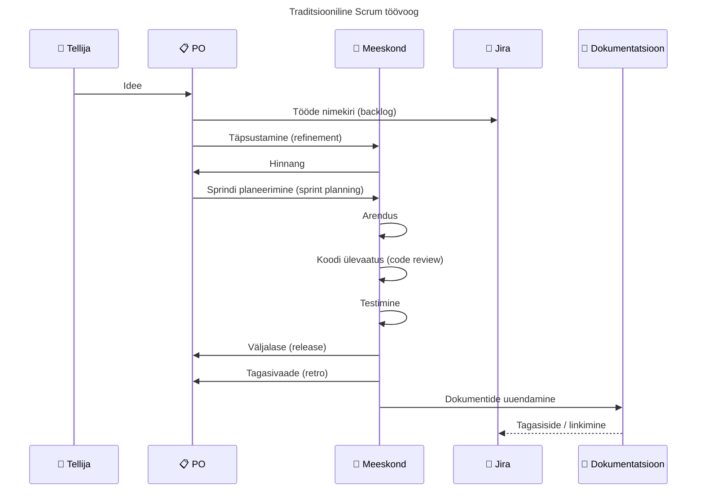
```mermaid
---
title: Traditsiooniline Scrum töövoog
---
sequenceDiagram
    participant ST as 👤 Tellija
    participant PO as 📋 PO
    participant Team as 👥 Meeskond
    participant Jira as 🎫 Jira
    participant Docs as 📄 Dokumentatsioon

    ST->>PO: Idee
    PO->>Jira: Tööde nimekiri (backlog)
    PO->>Team: Täpsustamine (refinement)
    Team->>PO: Hinnang
    PO->>Team: Sprindi planeerimine (sprint planning)
    Team->>Team: Arendus
    Team->>Team: Koodi ülevaatus (code review)
    Team->>Team: Testimine
    Team->>PO: Väljalase (release)
    Team->>PO: Tagasivaade (retro)
    Team->>Docs: Dokumentide uuendamine
    Docs-->>Jira: Tagasiside / linkimine
```

### Tagajärjed

- Dokumentatsioon vananeb kiiremini kui kood
- Dokumentatsiooni versioonihaldus on ebamugav (muudatuste jälgimine (track changes), Confluence versioonid)
- Otsused on laiali (piletid, Word, EA, Confluence, memod)
- Jälgitavus (traceability) on nõrk (raske siduda nõue → kood)
- Sisseelamine (onboarding) on aeglane, info asub mitmes kohas
- Ühe komponendi muutus vajab mitme repo ja Jira ruumi läbimist

**Põhiprobleem:** Kood ja dokumentatsioon ei asu samas süsteemis ning "tõde" on hajunud.

## Osa 2: Lahendus — spetsifikatsioonipõhine arendus

Kerge töövoog, kus **PO** prioritiseerib ja kinnitab, **analüütik** kirjutab nõuded, **arhitekt** lisab tehnilise disaini, **AI-agent** teostab ning jälgib edenemist ja **E2E testija** tagab kvaliteedi läbivate testidega. Analüüs ja arhitektuur on keskse süsteemi repositooriumis, teostus võib olla ühes või mitmes koodirepos ning "end-to-end" testid eraldi testirepos.

### Keskne repo + Cursor rollid

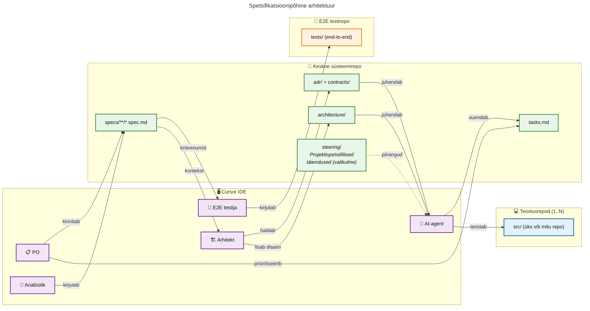
```mermaid
---
title: Spetsifikatsioonipõhine arhitektuur
---
flowchart LR
    subgraph Cursor["🖥️ Cursor IDE"]
        PO["📋 PO"]
        AN["📝 Analüütik"]
        AR["🏗️ Arhitekt"]
        AI["🤖 AI-agent"]
        QA["🧪 E2E testija"]
    end

    subgraph Repo["📁 Keskne süsteemirepo"]
        SPEC["specs/**/*.spec.md"]
        ARCH["architecture/"]
        ADR_C["adr/ + contracts/"]
        STEER["steering/<br/><i>Projektispetsiifilised<br/>täiendused (valikuline)</i>"]
        TASKS["tasks.md"]
    end

    subgraph Impl["💻 Teostusrepod (1..N)"]
        CODE["src/ (üks või mitu repo)"]
    end

    subgraph E2E["🧪 E2E testirepo"]
        E2ECODE["tests/ (end-to-end)"]
    end

    PO -->|"prioritiseerib"| TASKS
    PO -->|"kinnitab"| SPEC
    AN -->|"kirjutab"| SPEC
    AR -->|"lisab disaini"| ARCH
    AR -->|"haldab"| ADR_C
    AI -->|"teostab"| CODE
    AI -->|"uuendab"| TASKS
    STEER -.->|"piirangud"| AI
    SPEC -->|"kontekst"| AR
    ARCH -->|"juhendab"| AI
    ADR_C -->|"juhendab"| AI
    SPEC -->|"kriteeriumid"| QA
    QA -->|"kirjutab"| E2ECODE

    classDef cursor fill:#f3e5f5,stroke:#6a1b9a,stroke-width:2px,color:#111111
    classDef repo fill:#e8f5e9,stroke:#2e7d32,stroke-width:2px,color:#111111
    classDef impl fill:#e3f2fd,stroke:#01579b,stroke-width:2px,color:#111111
    classDef e2e fill:#fff3e0,stroke:#ef6c00,stroke-width:2px,color:#111111

    class PO,AN,AR,AI,QA cursor
    class SPEC,ARCH,ADR_C,STEER,TASKS repo
    class CODE impl
    class E2ECODE e2e
```

### Üks spetsifikatsioonide repo → mitu koodirepo

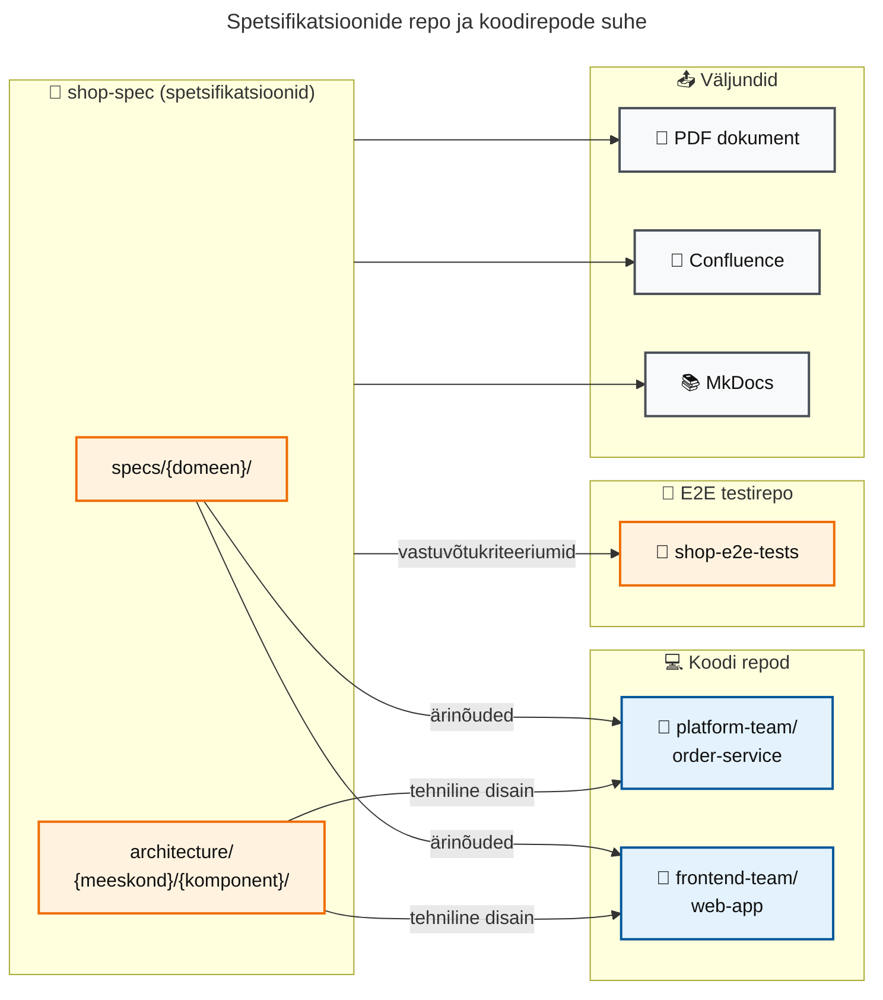
```mermaid
---
title: Spetsifikatsioonide repo ja koodirepode suhe
---
flowchart LR
    subgraph Analysis["📁 shop-spec (spetsifikatsioonid)"]
        SD["specs/{domeen}/"]
        SA["architecture/<br/>{meeskond}/{komponent}/"]
    end

    subgraph Code["💻 Koodi repod"]
        BE["🔧 platform-team/<br/>order-service"]
        FE["🎨 frontend-team/<br/>web-app"]
    end

    subgraph E2E["🧪 E2E testirepo"]
        E2EREPO["🧪 shop-e2e-tests"]
    end

    subgraph Export["📤 Väljundid"]
        PDF["📄 PDF dokument"]
        CONF["📝 Confluence"]
        MKDOCS["📚 MkDocs"]
    end

    SD -->|"ärinõuded"| BE
    SD -->|"ärinõuded"| FE
    SA -->|"tehniline disain"| BE
    SA -->|"tehniline disain"| FE
    Analysis -->|"vastuvõtukriteeriumid"| E2EREPO

    Analysis --> PDF
    Analysis --> CONF
    Analysis --> MKDOCS

    classDef analysis fill:#fff3e0,stroke:#ef6c00,stroke-width:2px,color:#111111
    classDef code fill:#e3f2fd,stroke:#01579b,stroke-width:2px,color:#111111
    classDef e2e fill:#fff3e0,stroke:#ef6c00,stroke-width:2px,color:#111111
    classDef export fill:#f8f9fa,stroke:#495057,stroke-width:2px,color:#111111

    class SD,SA analysis
    class BE,FE code
    class E2EREPO e2e
    class PDF,CONF,MKDOCS export
```

Spetsifikatsioonide repo struktuur:

- `specs/{domeen}/` — ärinõuded domeenide kaupa (analüütik)
- `architecture/{meeskond}/{komponent}/` — tehniline disain komponentide kaupa (arhitekt)
- `adr/` — arhitektuuriotsuste logid (arhitekt)
- `contracts/` — API lepingud (arhitekt)
- Vastuvõtukriteeriumid (`specs/**/*.spec.md`) → **E2E testirepo** (teststsenaariumide alus)

### Uus töövoog

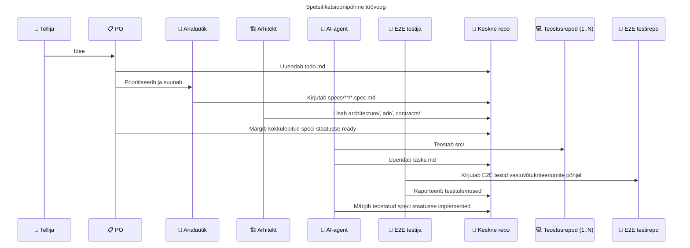
```mermaid
---
title: Spetsifikatsioonipõhine töövoog
---
sequenceDiagram
    participant ST as 👤 Tellija
    participant PO as 📋 PO
    participant AN as 📝 Analüütik
    participant AR as 🏗️ Arhitekt
    participant AI as 🤖 AI-agent
    participant QA as 🧪 E2E testija
    participant REPO as 📁 Keskne repo
    participant CODE as 💻 Teostusrepod (1..N)
    participant E2E as 🧪 E2E testirepo

    ST->>PO: Idee
    PO->>REPO: Uuendab todo.md
    PO->>AN: Prioritiseerib ja suunab
    AN->>REPO: Kirjutab specs/**/*.spec.md
    AR->>REPO: Lisab architecture/, adr/, contracts/
    PO->>REPO: Märgib kokkulepitud speci staatusse ready
    AI->>CODE: Teostab src/
    AI->>REPO: Uuendab tasks.md
    QA->>E2E: Kirjutab E2E testid vastuvõtukriteeriumite põhjal
    QA->>REPO: Raporteerib testitulemused
    AI->>REPO: Märgib teostatud speci staatusse implemented
```

### Staatuse voog

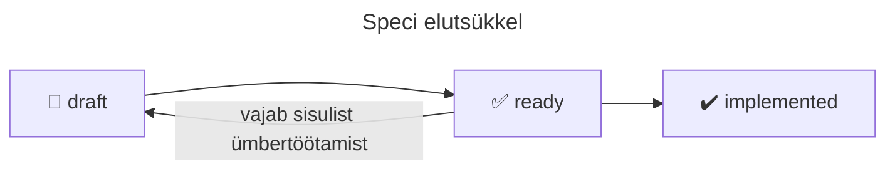
```mermaid
---
title: Speci elutsükkel
---
flowchart LR
    draft["📝 draft"] --> ready["✅ ready"]
    ready --> implemented["✔️ implemented"]
    ready -->|"vajab sisulist ümbertöötamist"| draft
```

### Spetsifikatsioon (spec) ja Cursori planeerimisrežiim (Plan Mode)

Analüütiku spetsifikatsioon (spec) **ei asenda** Cursori planeerimisrežiimi (Plan Mode). Need täidavad erinevaid rolle:

| Artefakt | Omanik | Otstarve |
| :------- | :----- | :------- |
| **Spetsifikatsioon (spec)** | Analüütik / Arhitekt | Ärinõuded, vastuvõtukriteeriumid, tehniline disain — *mida* ja *miks* |
| **Planeerimisrežiimi (Plan Mode) väljund** | AI-agent + Arendaja | Konkreetne teostusplaan — *kuidas* ja *mis järjekorras* |

**Plan Mode'i sisendid:**

Plan Mode ei loe ainult spetsifikatsiooni — ta võtab arvesse kogu projektikonteksti:

| Sisend | Kaust / fail | Mida annab |
| :----- | :----------- | :--------- |
| Spetsifikatsioon (spec) | `specs/**/*.spec.md` | Ärinõuded, kasutusjuhud, vastuvõtukriteeriumid |
| Prototüübid (valikuline) | `prototypes/**/*.html` | Visuaalne eeskuju, valideeritud ekraanipaigutused |
| Arhitektuur | `architecture/**/*.md` | Tehniline disain, API-d, andmemudelid |
| ADR-id | `adr/*.md` | Arhitektuuriotsused ja nende põhjendused |
| API lepingud | `contracts/**/*.yaml` | API lepingud (OpenAPI, AsyncAPI) |
| Cursori reeglid | `.cursor/rules/*.mdc` | Symlink kesksele `smit-development-standards` repole |
| Olemasolev kood | `src/**/*` | Praegune teostus ja kontekst |

**Miks Plan Mode on endiselt vajalik:**

1. **Arusaamise kontroll** — Plan Mode võimaldab arendajal ja AI-agendil veenduda, et mõlemad said ülesandest ühtemoodi aru enne koodi kirjutamist
2. **Konteksti süntees** — Plan Mode ühendab spetsifikatsiooni, arhitektuuri, ADR-id ja Cursori reeglid ühtseks teostusplaaniks
3. **Äärjuhtude avastamine** — planeerimise käigus tulevad välja tehnilised nüansid, mida äriline spetsifikatsioon ei kata
4. **Samm-sammuline valideerimine** — arendaja saab plaani üle vaadata ja vajadusel korrigeerida enne teostust

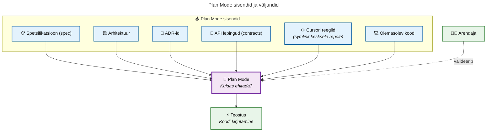
```mermaid
---
title: Plan Mode sisendid ja väljundid
---
flowchart TD
    subgraph Sisendid["📥 Plan Mode sisendid"]
        SPEC["📋 Spetsifikatsioon (spec)"]
        ARCH["🏗️ Arhitektuur"]
        ADR["📝 ADR-id"]
        CONTR["📄 API lepingud (contracts)"]
        RULES["⚙️ Cursori reeglid<br/><i>(symlink kesksele repole)</i>"]
        CODE["💻 Olemasolev kood"]
    end

    PLAN["🧠 Plan Mode<br/><i>Kuidas ehitada?</i>"]
    IMPL["⚡ Teostus<br/><i>Koodi kirjutamine</i>"]
    DEV["👨‍💻 Arendaja"]

    SPEC --> PLAN
    ARCH --> PLAN
    ADR --> PLAN
    CONTR --> PLAN
    RULES --> PLAN
    CODE --> PLAN
    
    PLAN --> IMPL
    DEV -.->|"valideerib"| PLAN

    classDef input fill:#e3f2fd,stroke:#01579b,stroke-width:2px,color:#111111
    classDef process fill:#f3e5f5,stroke:#6a1b9a,stroke-width:3px,color:#111111
    classDef output fill:#e8f5e9,stroke:#2e7d32,stroke-width:2px,color:#111111

    class SPEC,ARCH,ADR,CONTR,RULES,CODE input
    class PLAN process
    class IMPL,DEV output
```

> **Soovitus:** Kasuta Plan Mode'i alati enne keerulisemate funktsionaalsuste teostamist, isegi kui spetsifikatsioon (spec) on detailne. See on viimane kontrollpunkt enne koodi kirjutamist.

## Osa 3: Mis jääb, mis muutub, mis kaob?

### Miks kasutajalood (user stories) ei kao

Levinud väärarusaam: "AI-ga pole kasutajalugusid vaja." Tegelikult:

| Kiht | Omanik | Sisu | AI roll |
| :--- | :----- | :--- | :------ |
| **Äriline spetsifikatsioon (spec)** | Analüütik | Kasutusjuhud, vastuvõtukriteeriumid | Loeb kontekstiks |
| **Tehniline spetsifikatsioon (spec)** | Arhitekt | API lepingud, piirangud, mustrid | Täidab otse |

**Miks äriline kiht jääb:**

- Ärireeglid tulevad tellijalt, mitte arhitektuurist
- Vastuvõtukriteeriumid määravad, millal töö on "valmis"
- Kasutusjuhud annavad AI-le konteksti (vähendab hallutsinatsioone)
- Jälgitavus (traceability) — audiitorid ja uued liikmed vajavad ärilist põhjendust

### Mis muutub

| Traditsiooniline agiilne lähenemine (Agile) | Spetsifikatsioonipõhine arendus                                                                                                                                    |
| :------------------------------------------ |:-------------------------------------------------------------------------------------------------------------------------------------------------------------------|
| Kasutajalugu → Arendaja tõlgendab → Kood | Kasutajalugu → PO kinnitab → Arhitekt + AI → Tehniline spetsifikatsioon (spec) → AI → Kood → E2E testija valideerib                                                |
| Ebaselgus lahendatakse sprindi ajal | Ebaselgus lahendatakse ENNE teostust                                                                                                                               |
| "As a user, I want..." piisab | "As a user..." → API leping + piirangud                                                                                                                            |
| Arendajad hindavad (teostuse aega) | Analüütikud ja arhitektid hindavad (spetsifikatsiooni loomise aega), AI teostab ennustatavalt                                                                      |
| Pikad täpsustamised (refinement) | "Refinement" on arenduse osa, mida tehakse sprindi/arendustsükli jooksul ja uuendatakse iteratiivselt (vt [Iteratiivne valideerimine](#iteratiivne-valideerimine)) |
| Sprindi planeerimise (sprint planning) koosoleku ajal otsustatakse, mis läheb arendusse | PO jooksvalt suunab `todo.md` põhjal, mis läheb arendamisele/spetsifikatsiooni loomisesse |

### Mis kaob ära

| Täna | Uues lähenemises                                                                                                                    |
| :--- |:------------------------------------------------------------------------------------------------------------------------------------|
| Punktide (story point) hinnangud teostusele | Hinnatakse analüüsi ja arhitektuuri ajakulu, mitte teostust (vt [Mahuhinnangud](#mahuhinnangud-spetsifikatsioonipõhises-arenduses)) |
| 8-10 inimese meeskond | 5-6 inimese meeskond (PO, analüütik, arhitekt, 1-2 arendajat, E2E testija)                                                          |
| ~12h koosolekuid nädalas | ~2-3h nädalas                                                                                                                       |
| Dokumentatsiooni uuendamine käsitsi | Spetsifikatsioon (spec) = dokumentatsioon, uueneb töö käigus                                                                        |
| Confluence/Word/EA sünkroniseerimine | Üks repo, üks tõde                                                                                                                  |
| Jira ruumid per komponent | Üks Jira ruum + tasks.md (komponentide jälgimine Jira komponendi funktsionaalsusega)                                                |

## Struktuur

### Kahekihiline mudel: Domeenid ja komponendid

Spetsifikatsioonide repo kasutab **kahekihilist mudelit**, kus äriloogika ja tehniline teostus on eraldatud:

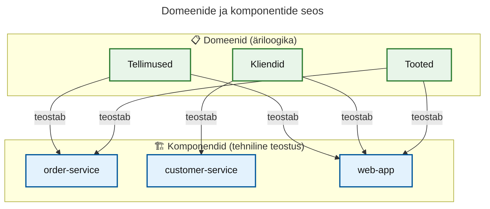
```mermaid
---
title: Domeenide ja komponentide seos
---
flowchart TB
    subgraph Domeenid["📋 Domeenid (äriloogika)"]
        D1["Tellimused"]
        D2["Kliendid"]
        D3["Tooted"]
    end

    subgraph Komponendid["🏗️ Komponendid (tehniline teostus)"]
        C1["order-service"]
        C2["customer-service"]
        C3["web-app"]
    end

    D1 -->|"teostab"| C1
    D1 -->|"teostab"| C3
    D2 -->|"teostab"| C2
    D2 -->|"teostab"| C3
    D3 -->|"teostab"| C1
    D3 -->|"teostab"| C3

    classDef domain fill:#e8f5e9,stroke:#2e7d32,stroke-width:2px,color:#111111
    classDef component fill:#e3f2fd,stroke:#01579b,stroke-width:2px,color:#111111

    class D1,D2,D3 domain
    class C1,C2,C3 component
```

| Kiht | Jaotus | Sisu | Omanik |
| :--- | :----- | :--- | :----- |
| **Domeenid (specs)** | Äriliste domeenide kaupa | Ärinõuded, UC-d, vastuvõtukriteeriumid | Analüütik |
| **Arhitektuur (architecture)** | Meeskond → Komponent | Tehniline disain, API-d, andmemudelid | Arhitekt |

**Miks selline jaotus?**

- **Domeenid on stabiilsed** — äriloogika muutub harva, isegi kui meeskonnad reorganiseeritakse
- **Komponendid peegeldavad Git struktuuri** — iga komponent vastab koodirepole, CI/CD on meeskonna-/projekti-põhine
- **Üks domeen võib hõlmata mitut komponenti** — nt "Tellimused" puudutab nii `order-service` kui `web-app` komponente
- **Üks komponent võib teenindada mitut domeeni** — nt `web-app` teostab nii tellimusi, kliente kui tooteid

### Spetsifikatsioonide repo (keskne süsteemirepo)

Struktuur sõltub projekti suurusest. Väiksematel projektidel on lihtsam struktuur, suurematel lisanduvad domeenid, meeskonnapõhine hierarhia ja eraldi `steering/` kaust.

**Lihtsam struktuur (1 meeskond, < 10 spetsifikatsiooni):**

```text
{project}-spec/
├── specs/                           # Ärinõuded — ANALÜÜTIK
│   ├── readme.md                   # Spetsifikatsioonide indeks
│   └── *.spec.md                  # Spetsifikatsioonid otse siin
│
├── architecture/                    # Tehniline disain — ARHITEKT
│   ├── overview.md                # Süsteemi arhitektuur + standardid
│   ├── backend/
│   │   ├── overview.md
│   │   └── *.md
│   └── frontend/
│       ├── overview.md
│       └── *.md
│
├── prototypes/                      # UI prototüübid — ANALÜÜTIK / ARHITEKT
│   ├── index.html                 # Prototüüpide navigeerimine
│   └── *.html                     # Ekraanide prototüübid (HTML + Tailwind)
│
├── adr/                            # Arhitektuuriotsuste logid — ARHITEKT
│   └── 001-{otsus}.md
├── contracts/                      # API lepingud (OpenAPI) — ARHITEKT
│   └── {komponent}-api.yaml
├── tasks.md                        # Backlog — JAGATUD (PO + Analüütik + Arhitekt)
├── todo.md                         # Tulevikuideed — PO
└── README.md                       # Projekti ülevaade
```

> **NB:** Lihtsamas struktuuris standardid (turvalisus, jälgitavus, nõuetele vastavus) asuvad `architecture/overview.md` failis. Eraldi `steering/` kausta pole vaja, kui süsteem on ühemeeskondlik.

**Täisstruktuur (mitu meeskonda, 10+ spetsifikatsiooni):**

```text
{project}-spec/
├── specs/                           # Ärinõuded (domeenipõhine) — ANALÜÜTIK
│   ├── readme.md                   # Domeenide indeks
│   │
│   ├── {domeen}/                   # Äriline domeen
│   │   ├── {domeen}.spec.md       # Domeeni spetsifikatsioon
│   │   └── readme.md              # Domeeni ülevaade
│   │
│   └── ...
│
├── architecture/                    # Tehniline disain (meeskond → komponent) — ARHITEKT
│   ├── overview.md                # Süsteemi ülevaade (kõrgem tase)
│   ├── readme.md                  # Komponentide indeks
│   │
│   ├── {meeskond}/                # Meeskond (Git projekti omanik)
│   │   ├── {komponent}/           # Komponent (koodirepo)
│   │   │   ├── overview.md       # Komponendi ülevaade
│   │   │   └── *.md              # Detailsed arhitektuuridokumendid
│   │   └── readme.md             # Meeskonna komponentide indeks
│   └── ...
│
├── adr/                            # Arhitektuuriotsuste logid — ARHITEKT
│   ├── {meeskond}/                # Meeskonna ADR-id
│   │   └── 001-{otsus}.md
│   └── shared/                    # Läbivad ADR-id
│       └── 001-{otsus}.md
├── contracts/                      # API lepingud (OpenAPI, AsyncAPI) — ARHITEKT
│   └── {meeskond}/                # Meeskonna API lepingud
│       └── {komponent}-api.yaml
├── steering/                        # Projektispetsiifilised standardid (valikuline)
│   └── *.md                       # Kui keskne repo ei kata kõiki vajadusi
├── prototypes/                      # UI prototüübid — ANALÜÜTIK / ARHITEKT
│   ├── index.html                 # Prototüüpide navigeerimine
│   ├── {ekraan}.html              # Põhiekraanide prototüübid
│   ├── {kategooria}/              # Alamkategooriad (nt debt/, insights/)
│   │   └── *.html
│   └── README.md                  # Prototüüpimise juhend
├── tasks.md                        # Backlog (spec olemas) — JAGATUD (PO + Analüütik + Arhitekt)
├── todo.md                         # Tulevikuideed (spec puudub) — PO
└── README.md                       # Projekti ülevaade
```

> **NB:** `steering/` kaust on valikuline. Kui organisatsioonil on keskne standardite repo (nt `idp-docs`), piisab sellele viitamisest `AGENTS.md` või `architecture/overview.md` failis. Kasuta lokaalset `steering/` kausta ainult projektispetsiifiliste täienduste jaoks.

### Koodirepo(d) (eraldi!)

Koodirepod on organiseeritud **meeskondade kaupa** Git projektidesse:

```text
{meeskond}-{komponent}/             # Eraldi Git repo (nt team-a/backend-service)
├── src/
│   ├── main/
│   └── test/
├── pom.xml / build.gradle
├── AGENTS.md                       # AI-agendi operatiivne kontekst
└── README.md

{meeskond}-frontend/                # Eraldi Git repo (nt team-a/frontend-app)
├── src/
│   ├── components/
│   └── pages/
├── package.json
├── AGENTS.md                       # AI-agendi operatiivne kontekst
└── README.md

e2e-tests/                          # Eraldi Git repo E2E testidele
├── tests/
│   ├── smoke/                     # "Smoke testid" (kiire tervisekontroll)
│   ├── regression/                # Regressioonitestid
│   └── e2e/                       # "End-to-end" stsenaariumid
├── fixtures/                       # Testandmed ja seadistused
├── playwright.config.ts            # Testimisraamistiku konfiguratsioon
├── AGENTS.md                       # AI-agendi kontekst testide jaoks
└── README.md
```

**Oluline:** Spetsifikatsioonide repo, koodirepo(d) ja E2E testirepo on **eraldi Git repositooriumid**. Spetsifikatsioonide repo on "tõe allikas" ärinõuete ja arhitektuuri jaoks, koodirepo(d) sisaldavad teostust ning E2E testirepo sisaldab läbivaid kvaliteediteste.

### Domeenide näide (suuremad projektid)

```text
# Analüütiku vastutus: specs/
specs/
├── readme.md                       # Domeenide indeks UC arvudega
│
├── orders/                         # Äriline domeen: Tellimused
│   ├── readme.md                  # Domeeni ülevaade
│   ├── orders.spec.md             # Põhispetsifikatsioon
│   └── returns.spec.md            # Alamspetsifikatsioon (tagastused)
│
├── customers/                      # Äriline domeen: Kliendid
│   ├── readme.md
│   ├── customers.spec.md
│   └── loyalty.spec.md            # Püsikliendiprogramm
│
├── products/                       # Äriline domeen: Tooted
│   ├── readme.md
│   └── products.spec.md
│
└── integrations/                   # Välised integratsioonid (domeeniülene)
    ├── readme.md
    ├── payment-gateway/           # Maksete integratsioon
    │   └── payment.spec.md
    └── shipping/                  # Tarneteenused
        └── shipping.spec.md

# Arhitekti vastutus: architecture/
architecture/
├── overview.md                    # Süsteemi ülevaade (kõrgem tase)
├── readme.md                      # Komponentide indeks
│
├── platform-team/                 # Meeskond (Git projekt: org/platform-team)
│   ├── readme.md                 # Meeskonna komponentide ülevaade
│   ├── order-service/            # Komponent (repo: platform-team/order-service)
│   │   ├── overview.md
│   │   └── orders.md             # Kuidas see komponent teostab tellimusi
│   └── api-gateway/              # Komponent (repo: platform-team/api-gateway)
│       └── overview.md
│
└── frontend-team/                 # Meeskond (Git projekt: org/frontend-team)
    ├── readme.md
    ├── web-app/                  # Komponent (repo: frontend-team/web-app)
    │   ├── overview.md
    │   └── checkout.md           # Ostukorvi ja tellimise UI
    └── admin-portal/             # Komponent (repo: frontend-team/admin-portal)
        └── overview.md
```

### Domeeni ja komponendi seoste dokumenteerimine

**Domeeni spetsifikatsioonis** viidatakse komponentidele, mis seda teostavad:

```yaml
# specs/orders/orders.spec.md
---
components:                         # Millised komponendid teostavad seda domeeni
  - platform-team/order-service
  - frontend-team/web-app
related_domains:                    # Seotud domeenid
  - customers
  - products
---
```

**Komponendi arhitektuuris** viidatakse domeenidele, mida see teenindab:

```yaml
# architecture/platform-team/order-service/overview.md
---
component: order-service
team: platform-team
repo: git.org/platform-team/order-service
domains:                            # Milliseid domeene see komponent teenindab
  - orders
  - products
---
```

**Millal kasutada domeene:**

- Projektis on 10+ spetsifikatsiooni (spec)
- On selged piiritletud ärilised kontekstid (nt tellimused, kliendid, tooted)
- Mitu analüütikut töötavad paralleelselt
- Äriloogika hõlmab mitut tehnilist komponenti

### Failide omanikud

| Fail | Omanik | Otstarve | AI kasutab |
| :--- | :----- | :------- | :--------- |
| `specs/{domeen}/*.spec.md` | **Analüütik** (PO kinnitab) | Ärinõuded (spetsifikatsioonid), UC-d, kriteeriumid | Kontekstiks |
| `specs/{domeen}/readme.md` | **Analüütik** | Domeeni ülevaated, indeksid | Kontekstiks |
| `architecture/overview.md` | **Arhitekt** | Süsteemi ülevaade, NFR-id, evituskeskkond | ✅ Peamine |
| `architecture/{meeskond}/{komponent}/*.md` | **Arhitekt** | Tehniline disain, API-d, piirangud | ✅ Peamine |
| `architecture/{meeskond}/readme.md` | **Arhitekt** | Meeskonna komponentide indeks | Kontekstiks |
| `prototypes/*.html` | **Analüütik / Arhitekt** | UI prototüübid valideerimiseks (HTML + Tailwind) | Kontekstiks |
| `adr/{meeskond}/*.md` | **Arhitekt** | Meeskonna arhitektuuriotsused | ✅ Viitena |
| `adr/shared/*.md` | **Arhitekt** | Läbivad arhitektuuriotsused | ✅ Viitena |
| `contracts/{meeskond}/*.yaml` | **Arhitekt** | Meeskonna API lepingud (OpenAPI) | ✅ Rangelt |
| `steering/*.md` | **Arhitekt** | Projektispetsiifilised täiendused (valikuline) | ✅ Kui eksisteerib |
| `tasks.md` | **Jagatud** — PO prioritiseerib, analüütik lisab spec-ülesandeid, arhitekt lisab arhitektuuriülesandeid, AI-agent uuendab staatust | Backlog (spec olemas) | ✅ Loeb ja uuendab |
| `todo.md` | **PO** (prioritiseerib ja uuendab) / AI-agent (uuendab) | Tulevikuideed (spec puudub) | ✅ Loeb ja uuendab |
| `e2e-tests/**/*` | **E2E testija** | "End-to-end" testid, "smoke testid", regressioonitestid | Kontekstiks + genereerib |

> **Põhimõte:** PO prioritiseerib ja kinnitab *mida* ehitada. Analüütik kirjutab *mida* ja *miks* domeenipõhiselt (inimloetav). Arhitekt teisendab selle *kuidas*-ks komponendipõhiselt (AI-täidetav) ja vastutab `architecture/`, `adr/` ning `contracts/` kaustade eest. E2E testija valideerib *kas* tulemus vastab kriteeriumidele. `tasks.md` on jagatud vastutus: PO prioritiseerib, analüütik ja arhitekt lisavad ülesandeid oma valdkonnast, AI-agent uuendab staatust. AI kasutab keskse `smit-development-standards` repo reegleid (symlingitud `.cursor/rules/` kausta), `architecture/` ning `contracts/` faile, võttes `specs/{domeen}/*.spec.md` äriliseks kontekstiks.

### Suunavad failid (steering) ja organisatsiooni standardid

Projektitaseme piirangud, mida AI peab alati järgima. Neid saab hallata mitmel viisil:

**Variant A: Keskne organisatsiooni repo (soovitatav suurematele organisatsioonidele)**

Organisatsiooniülesed standardid elavad eraldi repos, mida viidatakse spetsifikatsioonide repost. SMIT-is on kaks keskset repot:

```text
# 1. Dokumentatsioon ja juhendid (idp-docs/)
docs/
├── 02-development-guidelines/
│   ├── technology-standards.md        # Tehnoloogia valikud
│   ├── database-standards.md          # Andmebaasi standardid
│   ├── integration-requirements.md    # Integratsiooni nõuded
│   ├── logging-requirements.md        # Logimise nõuded
│   ├── ci-cd-pipeline-standardization.md
│   └── ...
├── 06-architecture-governance/
├── 09-ai-development-tools/
└── 10-security-compliance/

# 2. Cursor AI reeglid (smit-development-standards/)
rules/
├── common/
│   ├── component-technical-standards.mdc
│   ├── integration-standards.mdc
│   └── security.mdc
├── java-spring-boot/
├── java-micronaut/
├── typescript-vue/
├── typescript-nuxt/
└── ...
```

**Eelised:**
- Üks tõe allikas kogu organisatsioonile
- Muudatused jõustuvad kõigile projektidele korraga
- Versioonihaldus ja ajalugu keskses kohas

**Kasutamine:** Spetsifikatsioonide repo `architecture/overview.md` viitab kesksetele repodele:

```markdown
## Organisatsiooni standardid

- **Arendusjuhendid:** [IDP Documentation](https://source.smit.sise/projects/IDP/repos/idp-docs/browse/docs/02-development-guidelines/)
- **Cursor AI reeglid:** [SMIT Development Standards](https://source.smit.sise/projects/IDP/repos/smit-development-standards/browse)
```

**Cursor workspace'i seadistus:**

`idp-docs` ei pea alati workspace'is olema — lisa see vajadusel:

| Tegevus | Kas `idp-docs` vajalik? |
| :------ | :---------------------- |
| Igapäevane arendus / implementeerimine | ❌ Ei — Cursor rules tulevad symlingitud `smit-development-standards` repost |
| Uue speci kirjutamine | ✅ Jah — AI saab valideerida organisatsiooni standardite vastu |
| Arhitektuuri ülevaatus | ✅ Jah — AI näeb keskset dokumentatsiooni |
| Küsimused org. standardite kohta | ✅ Jah — "Mida ütleb technology-standards.md?" |

```json
// *.code-workspace (kui vaja idp-docs)
{
  "folders": [
    { "path": "software-catalog-specs" },
    { "path": "software-catalog-backend" },
    { "path": "idp-docs" }  // Lisa vajadusel
  ]
}
```

**Variant B: Lokaalne `steering/` kaust (sobib väiksematele projektidele)**

Kui projekt on iseseisev või vajab projektispetsiifilisi reegleid:

| Fail | Sisu |
| :--- | :--- |
| `steering/component-standards.md` | Teenuste nimed, API versioonid, DB skeemid |
| `steering/security.md` | Autentimine, OIDC, saladuste haldus |
| `steering/integration.md` | REST/OpenAPI standardid, välissüsteemid |

**Variant C: Cursor rules implementatsiooni repodes**

AI-agendi jaoks optimeeritud formaat `.cursor/rules/*.mdc` failides, mis asuvad otse koodirepodes:

```text
# Koodirepo (nt order-service/)
├── .cursor/
│   └── rules/
│       ├── java-standards.mdc      # Keelespetsiifilised reeglid
│       ├── api-conventions.mdc     # API mustrid
│       └── testing.mdc             # Testimise nõuded
└── src/
```

**Praktikas kombineeritakse variante:**

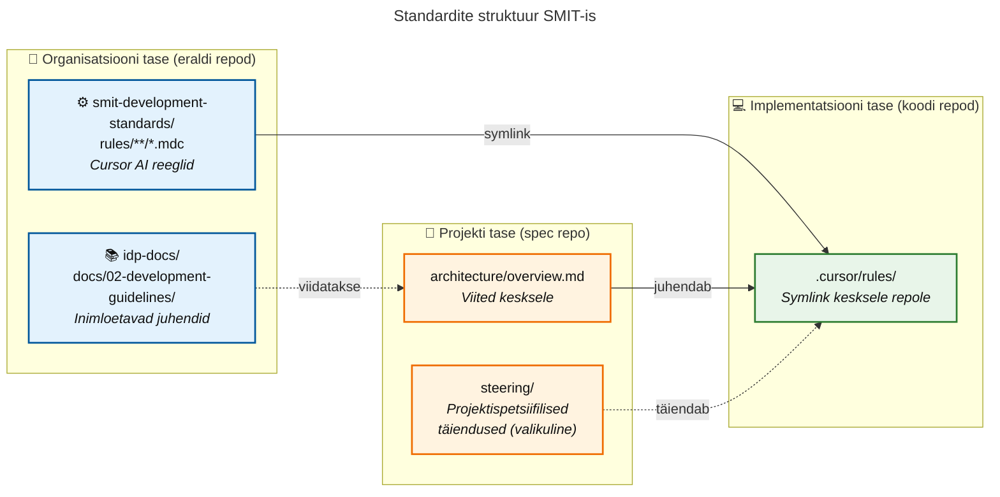
```mermaid
---
title: Standardite struktuur SMIT-is
---
flowchart LR
    subgraph ORG["🏢 Organisatsiooni tase (eraldi repod)"]
        IDP["📚 idp-docs/<br/>docs/02-development-guidelines/<br/><i>Inimloetavad juhendid</i>"]
        RULES["⚙️ smit-development-standards/<br/>rules/**/*.mdc<br/><i>Cursor AI reeglid</i>"]
    end

    subgraph PROJ["📁 Projekti tase (spec repo)"]
        STEER["steering/<br/><i>Projektispetsiifilised<br/>täiendused (valikuline)</i>"]
        ARCH["architecture/overview.md<br/><i>Viited kesksele</i>"]
    end

    subgraph IMPL["💻 Implementatsiooni tase (koodi repod)"]
        CURSOR[".cursor/rules/<br/><i>Symlink kesksele repole</i>"]
    end

    IDP -.->|"viidatakse"| ARCH
    RULES -->|"symlink"| CURSOR
    ARCH -->|"juhendab"| CURSOR
    STEER -.->|"täiendab"| CURSOR

    classDef org fill:#e3f2fd,stroke:#01579b,stroke-width:2px,color:#111111
    classDef proj fill:#fff3e0,stroke:#ef6c00,stroke-width:2px,color:#111111
    classDef impl fill:#e8f5e9,stroke:#2e7d32,stroke-width:2px,color:#111111

    class IDP,RULES org
    class STEER,ARCH proj
    class CURSOR impl
```

**Selgitus:**

1. **Organisatsiooni tase** — kaks eraldi repot:
   - `idp-docs` — inimloetavad juhendid (technology-standards.md, database-standards.md jne)
   - `smit-development-standards` — Cursor AI reeglid `.mdc` formaadis

2. **Projekti tase** — speci repo:
   - `architecture/overview.md` — viitab kesksetele repodele
   - `steering/` — valikuline kaust projektispetsiifiliste täienduste jaoks

3. **Implementatsiooni tase** — koodi repod:
   - `.cursor/rules/` — **symlink** kesksele `smit-development-standards` repole

**Symlinki loomine:**

```bash
# Koodirepos (nt software-catalog-backend/)
ln -s ../../smit-development-standards/rules/java-spring-boot .cursor/rules/java-spring-boot
ln -s ../../smit-development-standards/rules/common .cursor/rules/common
```

> **Soovitus:** Kasuta symlinke, et keskse repo muudatused jõustuksid automaatselt. Kopeeri lokaalselt ainult siis, kui projekt vajab erandeid.

**Erinevus ADR-st:** Suunavad failid (steering) = kohustuslikud reeglid. ADR = otsuse dokumentatsioon (miks nii tehti).

### AGENTS.md

`AGENTS.md` on AI-agendi **operatiivne kontekst**. See fail annab agendile kiire ülevaate, kuidas repos töötada, ilma et ta peaks kõiki dokumente läbi lugema.

**Koodirepo AGENTS.md:**
- Kuidas käivitada serverit
- Kuidas käivitada teste
- Marsruutide tabel, selektorid
- Koodi stiil, levinud mustrid
- Tehnoloogiapinu ja versioonid

**Spetsifikatsioonide repo AGENTS.md:**
- Repo eesmärk (spetsifikatsioonid, mitte kood)
- Workspace'i struktuur (kus on koodirepod)
- Kust lugeda spece, contracte, ADR-e
- Kuidas tasks.md töötab
- Seos teiste repodega

> **Põhimõte:** Spetsifikatsioonide repo `AGENTS.md` ütleb *mida* ja *kust* lugeda. Koodirepo `AGENTS.md` ütleb *kuidas* töötada.

### ADR-d (arhitektuuriotsuste kirjed / Architecture Decision Records)

Olulised arhitektuuriotsused talletatakse `adr/` kausta:

```text
adr/
├── 001-jooq-over-jpa.md
├── 002-redis-pubsub.md
└── 003-api-versioning.md
```

**Millal luua ADR:**

- Kaldutakse kõrvale arhitektuurist
- Uus läbiv muster (nt "kõik teenused vajavad kaitselülitit (circuit breaker)")
- Tehnoloogiavalik (nt "ClickHouse, mitte TimescaleDB")
- Turvalahendus (nt "väljatasemel krüpteerimine PII jaoks")
- **Keskse reegli ülekirjutamine** — kui konkreetses projektis on põhjendatud erand suunavast reeglist (steering)

ADR-i staatused: `proposed` → `accepted` → `deprecated` / `superseded`

> **Näide:** Kui `steering/security.md` nõuab JWT autentimist, aga konkreetne süsteem vajab mTLS-i, siis luuakse ADR, mis dokumenteerib erandi ja selle põhjenduse. ADR viitab suunavale reeglile, mida ta üle kirjutab.

## Cursor tööruum (workspace) seadistus arendajale

Kuna spetsifikatsioonide repo ja koodirepo(d) on eraldi Git repositooriumid, tuleb need Cursoris ühendada ühte tööruumi.

### Seadistamine

1. **Klooni repod kõrvuti:**

   ```text
   ~/projects/
   ├── shop-spec/                    # Spetsifikatsioonide repo (specs, architecture, steering)
   ├── platform-team/
   │   └── order-service/            # Backend koodirepo
   ├── frontend-team/
   │   └── web-app/                  # Frontend koodirepo
   └── shop-e2e-tests/               # E2E testirepo
   ```

2. **Ava Cursoris koodirepo** (nt `platform-team/order-service`)

3. **Lisa spetsifikatsioonide repo tööruumi (workspace):**
   - `File` → `Add Folder to Workspace...`
   - Vali `shop-spec` kaust

4. **Salvesta tööruum (workspace)** (valikuline):
   - `File` → `Save Workspace As...`
   - Nt `order-service.code-workspace`

### Miks see töötab

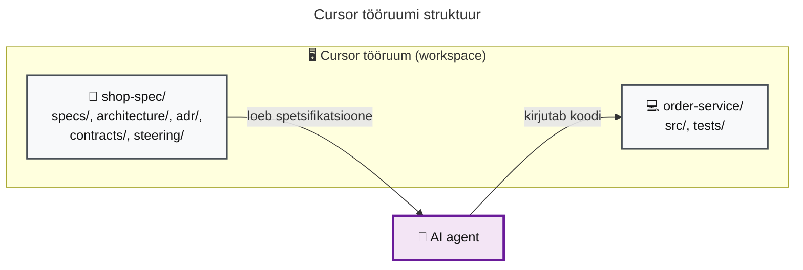
```mermaid
---
title: Cursor tööruumi struktuur
---
flowchart LR
    subgraph Workspace["🖥️ Cursor tööruum (workspace)"]
        AR["📁 shop-spec/<br/>specs/, architecture/, adr/,<br/>contracts/, steering/"]
        CR["💻 order-service/<br/>src/, tests/"]
    end

    AI["🤖 AI agent"]

    AR -->|"loeb spetsifikatsioone"| AI
    AI -->|"kirjutab koodi"| CR

    classDef workspace fill:#f8f9fa,stroke:#495057,stroke-width:2px,color:#111111
    classDef ai fill:#f3e5f5,stroke:#6a1b9a,stroke-width:3px,color:#111111

    class AR,CR workspace
    class AI ai
```

**Eelised:**

- Agent näeb **nii spetsifikatsioone (spec) kui koodi** ühes kontekstis
- Saad öelda: `@specs/views/dashboard.spec.md implementeeri UC-DASH-1`
- Agent järgib automaatselt `steering/` reegleid
- Sissekanded (commit) lähevad **õigesse reposse** (kood koodireposse, spetsifikatsiooni (spec) muudatused spetsifikatsioonide reposse)

### Skaleerumine mitme koodirepoga

Sama lähenemine töötab olenemata koodirepode arvust:

| Stsenaarium | Tööruumi (workspace) sisu |
| :---------- | :------------------------ |
| Üks monoliit | `analysis/` + `app/` + `e2e-tests/` |
| Backend + Frontend | `analysis/` + `backend/` + `frontend/` + `e2e-tests/` |
| Mikroteenused | `analysis/` + `service-a/` + `service-b/` + `e2e-tests/` |

**Näide mikroteenuste puhul:**

```text
~/projects/
├── shop-spec/                      # Üks keskne spetsifikatsioonide repo
├── platform-team/
│   ├── order-service/              # Mikroteenuse repo 1
│   ├── payment-service/            # Mikroteenuse repo 2
│   └── notification-service/       # Mikroteenuse repo 3
├── frontend-team/
│   └── web-app/                    # Frontend repo
└── shop-e2e-tests/                 # E2E testirepo (ühine kõigile teenustele)
```

Cursoris avad ühe komponendi ja lisad spetsifikatsioonide repo. Kui liigud teise komponendi juurde, avad uue tööruumi sama spetsifikatsioonide repoga.

> **Vihje:** Loo iga komponendi jaoks eraldi `.code-workspace` fail, mis sisaldab seda komponenti + spetsifikatsioonide repo. Nii on kiire vahetada konteksti.

## Kuidas Cursor IDE toetab iga rolli

Cursor ei ole lihtsalt koodiredaktor — see on AI-assistent, mis tunneb kogu repositooriumi konteksti.

### PO (Product Owner)

| Võimalus | Kasu |
| :------- | :--- |
| **Backlog'i ülevaade** | Küsi: "Millised specid on draft staatuses?" — AI annab kogu ülevaate |
| **Prioritiseerimine** | Küsi: "Millised UC-d on kõige suurema ärimõjuga?" — AI aitab analüüsida |
| **Edenemise jälgimine** | Küsi: "Kui palju spece on draft vs ready vs implemented?" — AI loeb spec-failide frontmatter `status` väljad kokku |
| **Kinnitamine** | Vaata üle analüütiku draft spec ja märgi see `ready` — AI aitab valideerida terviklikkust |
| **Ümberavamine** | Kui `ready` spec vajab enne teostust sisulist muudatust, vii see tagasi `draft`-i — AI aitab mõju analüüsida |
| **Sõltuvuste tuvastamine** | Küsi: "Millised UC-d sõltuvad UC-DASH-1 valmimisest?" — AI leiab ristviited |

### Analüütik

| Võimalus | Kasu |
| :------- | :--- |
| **Vestlus kogu dokumentatsiooniga** | Küsi: "Kas meil on juba sarnane UC kusagil?" — AI leiab üles |
| **Ristanalüüs** | Küsi: "Millised spetsifikatsioonid (spec) viitavad autentimisele?" — näeb seoseid |
| **Muudatuste mõjuanalüüs** | Muudad ühe spetsifikatsiooni (spec) → AI ütleb, milliseid teisi see mõjutab |
| **Valideerimise tugi** | "Kas see spetsifikatsioon (spec) katab kõik vastuvõtukriteeriumid?" — AI kontrollib |
| **Prototüüpide loomine** | "Loo HTML+Tailwind prototüüp UC-DASH-1 jaoks" — AI genereerib interaktiivse prototüübi `prototypes/` kausta |
| **Ei jää midagi kahe silma vahele** | AI näeb tervet repo, mitte ainult avatud faili |

### Arhitekt

| Võimalus | Kasu |
| :------- | :--- |
| **Arhitektuuri vastavuskontroll** | "Kas see disain vastab organisatsiooni standarditele?" — AI valideerib `idp-docs` ja `smit-development-standards` vastu |
| **ADR-de genereerimine** | "Loo ADR selle otsuse kohta" — AI vormistab õigesse formaati |
| **API lepingute valideerimine** | "Kas contracts/order-service-api.yaml vastab spetsifikatsiooni (spec) nõuetele?" |
| **Mustrite järjepidevus** | "Kas see komponent järgib sama mustrit mis teised?" |
| **Prototüüpide ülevaatus** | "Kas see prototüüp vastab UC nõuetele?" — AI võrdleb `prototypes/*.html` ja `specs/**/*.spec.md` |
| **Tehnilise disaini täiendamine** | AI soovitab puuduvaid aspekte (veakäsitlus (error handling), vahemälu (caching) jne) |

### Arendaja / AI-agent

| Võimalus | Kasu |
| :------- | :--- |
| **Selge sisend agendile** | `@specs/views/dashboard.spec.md` + `@architecture/frontend/` + `@prototypes/dashboard.html` → agent teab täpselt mida teha |
| **Testide genereerimine** | "Loo testid UC-DASH-1 vastuvõtukriteeriumite põhjal" |
| **Organisatsiooni standardite järgimine** | Agent loeb automaatselt symlingitud `.cursor/rules/` reegleid kesksest `smit-development-standards` repost |
| **Koodi ja spetsifikatsiooni (spec) sünkroonis hoidmine** | Agent uuendab `tasks.md` staatust töö käigus |
| **Refaktoreerimine turvalises kontekstis** | Agent teab, milliseid teisi komponente muudatus mõjutab |

### E2E testija

| Võimalus | Kasu |
| :------- | :--- |
| **Teststsenaariumide genereerimine** | `@specs/views/dashboard.spec.md` → AI genereerib "end-to-end" teststsenaariumid vastuvõtukriteeriumite põhjal |
| **Regressioonitestide täiendamine** | Uue UC lisamisel küsi: "Millised regressioonitestid vajavad uuendamist?" — AI analüüsib mõju |
| **Testide ja spetsifikatsiooni (spec) ristvalideerimine** | "Kas kõik vastuvõtukriteeriumid on testidega kaetud?" — AI võrdleb spec ja teste |
| **Testandmete genereerimine** | "Loo "fixtures" UC-DASH-1 jaoks" — AI genereerib sobivad testandmed |
| **"Smoke testide" loomine** | "Loo "smoke testid" kriitiliste kasutajateede jaoks" — AI tuvastab kriitilised vood |

### Kokkuvõte: AI kui meeskonnaliige

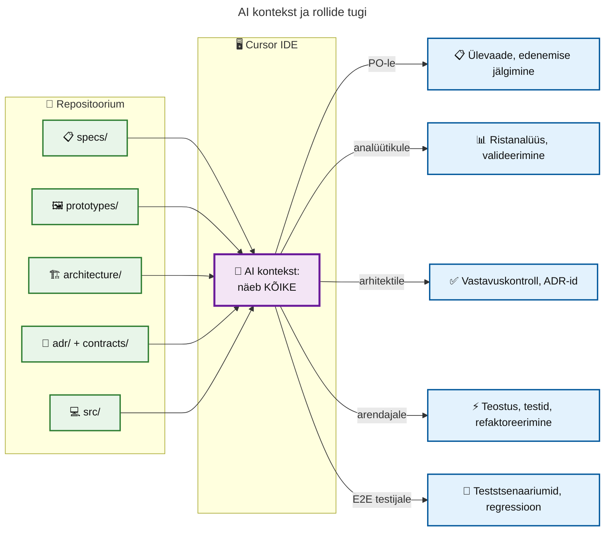
```mermaid
---
title: AI kontekst ja rollide tugi
---
flowchart LR
    subgraph Repo["📁 Repositoorium"]
        SPEC["📋 specs/"]
        PROTO["🖼️ prototypes/"]
        ARCH["🏗️ architecture/"]
        ADR_C2["📝 adr/ + contracts/"]
        CODE["💻 src/"]
    end

    subgraph Cursor["🖥️ Cursor IDE"]
        AI["🤖 AI kontekst:<br/>näeb KÕIKE"]
    end

    SPEC --> AI
    PROTO --> AI
    ARCH --> AI
    ADR_C2 --> AI
    CODE --> AI

    AI -->|"PO-le"| A0["📋 Ülevaade, edenemise jälgimine"]
    AI -->|"analüütikule"| A1["📊 Ristanalüüs, valideerimine"]
    AI -->|"arhitektile"| A2["✅ Vastavuskontroll, ADR-id"]
    AI -->|"arendajale"| A3["⚡ Teostus, testid, refaktoreerimine"]
    AI -->|"E2E testijale"| A4["🧪 Teststsenaariumid, regressioon"]

    classDef repo fill:#e8f5e9,stroke:#2e7d32,stroke-width:2px,color:#111111
    classDef ai fill:#f3e5f5,stroke:#6a1b9a,stroke-width:3px,color:#111111
    classDef output fill:#e3f2fd,stroke:#01579b,stroke-width:2px,color:#111111

    class SPEC,PROTO,ARCH,ADR_C2,CODE repo
    class AI ai
    class A0,A1,A2,A3,A4 output
```

**Põhiline erinevus:** Traditsiooniliselt peab iga roll ise meeles pidama, mida teised on teinud. Cursoriga on AI see, kes "mäletab" kogu konteksti ja aitab iga rolli oma vaatenurgast.

## Parimad praktikad

### See EI OLE koskmudel (waterfall)

Levinud väärarusaam on, et spetsifikatsioonipõhine arendus tähendab "kõigepealt kirjuta kõik valmis, siis hakka kodeerima". **See pole tõsi.** Spetsifikatsioonipõhine arendus on iteratiivne protsess, kus:

- Spetsifikatsioon (spec) on **elav dokument**, mis areneb koos projektiga
- Alusta minimaalse spetsifikatsiooniga ja täienda vastavalt õpitule
- Iga iteratsioon võib tuua uusi nõudeid, mis lisatakse spetsifikatsiooni
- Spetsifikatsioon ei pea olema "täiuslik" enne teostust — piisab, kui see on "piisavalt hea" järgmise sammu jaoks

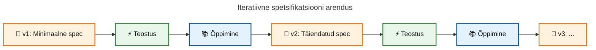
```mermaid
---
title: Iteratiivne spetsifikatsiooni arendus
---
flowchart LR
    V1["📝 v1: Minimaalne spec"] --> I1["⚡ Teostus"]
    I1 --> L1["📚 Õppimine"]
    L1 --> V2["📝 v2: Täiendatud spec"]
    V2 --> I2["⚡ Teostus"]
    I2 --> L2["📚 Õppimine"]
    L2 --> V3["📝 v3: ..."]

    classDef spec fill:#fff3e0,stroke:#ef6c00,stroke-width:2px,color:#111111
    classDef impl fill:#e8f5e9,stroke:#2e7d32,stroke-width:2px,color:#111111
    classDef learn fill:#e3f2fd,stroke:#01579b,stroke-width:2px,color:#111111

    class V1,V2,V3 spec
    class I1,I2 impl
    class L1,L2 learn
```

**Erinevus koskmudelist:**

- Koskmudel: Spec → Disain → Kood → Test → Valmis (lineaarne, tagasipöördumine kallis)
- Spetsifikatsioonipõhine: Spec ↔ Disain ↔ Kood ↔ Test (iteratiivne, muudatused odavad)

### Õppetundide kodeerimine spetsifikatsiooni

Teostuse käigus õpitud asjad tuleb **tagasi kodeerida spetsifikatsiooni**, et tulevikus sama funktsionaalsust taasluues ei peaks kõiki avastusi uuesti tegema.

**Mida kodeerida:**

| Kategooria | Näide |
| :--------- | :---- |
| **Kogemuspõhised otsused** | "Lehekülgedeks jagamine eemaldati, sest see nõudis kohandatud JavaScripti, mis läks konflikti staatilise saidi eesmärgiga" |
| **Disainimustrid** | "Kaardid peavad olema fikseeritud laiusega, et vältida hüppamist erinevate ekraanisuuruste vahel" |
| **Piirangud** | "Maksimaalselt 20 elementi lehel jõudluse tagamiseks" |

**Kuidas kodeerida:**

1. **Pärast iteratsiooni** — küsi AI-lt: "Kirjuta õppetunnid ja kogemuslikud otsused (mitte tehnilised detailid) spetsifikatsiooni"
2. **Eralda kogemus tehnikast** — spetsifikatsioon kirjeldab *mida* ja *miks*, mitte *kuidas*
3. **Teisenda õppetunnid funktsionaalseteks nõueteks** — "kasutaja soovib..." → konkreetne vastuvõtukriteerium

**Miks see on oluline:**

- Kui tehnoloogiat vahetatakse (nt Nuxt → uus raamistik), saab sama spetsifikatsiooniga **taasluua identse kasutajakogemuse**
- Väldib korduvaid avastusvestlusi AI-ga
- Loob institutsionaalse mälu, mis ei sõltu konkreetsest teostusest

> **Analoogia:** Kood on nagu renderdatud MP4 fail videoprojektis. Kui tahad muudatust, redigeerid projekti, mitte piksleid renderdatud videos. Spetsifikatsioon on see "projekt".

### Paralleelne planeerimine Git harude abil

Analüütik ja arhitekt saavad **töötada järgmise versiooni kallal** samal ajal, kui AI-agent teostab praegust versiooni. See võimaldab pidevat planeerimist ilma arendust segamata.

**Soovitatav harude struktuur:**

| Haru | Otstarve | Omanik |
| :--- | :------- | :----- |
| `main` | Stabiilne spetsifikatsioon, mille põhjal AI-agent teostab | Arhitekt (kinnitab) |
| `develop` | Pooleliolev planeerimine järgmise versiooni jaoks | Analüütik, Arhitekt |
| `feature/*` | Konkreetse funktsionaalsuse spetsifikatsioon | Analüütik |

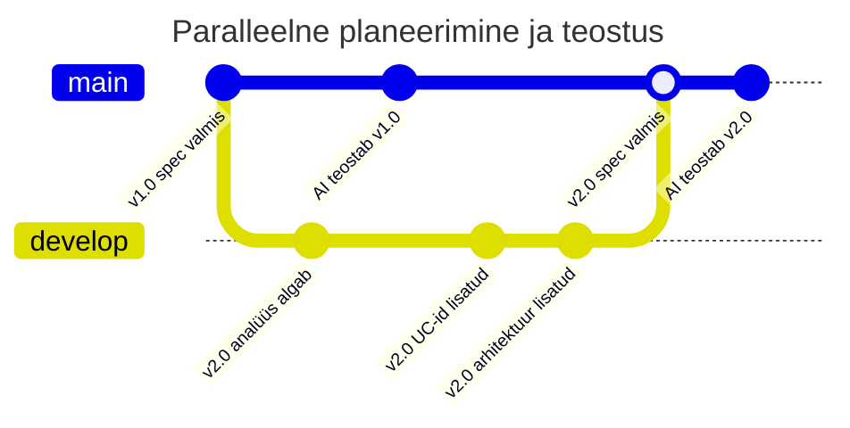
```mermaid
---
title: Paralleelne planeerimine ja teostus
---
gitGraph
    commit id: "v1.0 spec valmis"
    branch develop
    commit id: "v2.0 analüüs algab"
    checkout main
    commit id: "AI teostab v1.0"
    checkout develop
    commit id: "v2.0 UC-id lisatud"
    commit id: "v2.0 arhitektuur lisatud"
    checkout main
    merge develop id: "v2.0 spec valmis"
    commit id: "AI teostab v2.0"
```

**Töövoog:**

1. **main haru** sisaldab kinnitatud spetsifikatsiooni, mille põhjal AI-agent töötab
2. **develop haru** on analüütiku ja arhitekti "töölaud", kus nad valmistavad ette järgmist versiooni
3. Kui uus versioon on valmis ja üle vaadatud, liidetakse see `main` harusse
4. AI-agent alustab uue versiooni teostamist

**Eelised:**

- Analüütik ei pea ootama, kuni AI-agent lõpetab — ta saab juba järgmist versiooni planeerida
- Arendus ja planeerimine toimuvad paralleelselt
- Selge eraldus: "mida praegu ehitatakse" vs "mida järgmisena ehitatakse"
- Versiooniajalugu säilib — saab alati vaadata, milline spetsifikatsioon oli mingi hetkel kehtiv

### UI prototüüpimine

Enne teostust on kasulik valideerida kasutajaliidese ekraane prototüüpidega. Prototüübid elavad spetsifikatsioonide repos `prototypes/` kaustas ja on viidatud spetsifikatsioonides.

**Prototüüpimise lähenemised:**

| Lähenemine | Sobib | Plussid | Miinused |
| :--------- | :---- | :------ | :------- |
| **HTML + Tailwind** | Ekraanide paigutuse valideerimine, komponentide struktuur, põhilised interaktsioonid | Interaktiivne, ei vaja ehitustööriistu, elab Gitis, lihtne itereerida AI-ga | Nõuab baasteadmisi HTML-ist |
| **ASCII raamjoonis (wireframe)** | Kiired visandid speci sees, tekstipõhised ülevaatused | Null sõltuvusi, on juba speci sees | Piiratud visuaalne täpsus, raske itereerida |
| **AI-genereeritud pildid** | Kontseptsiooni uurimine, sidusrühmade demo | Väga kiire genereerida | Staatiline, ei saa interaktsioone teha, raske järjepidevalt uuendada |
| **Figma / disainitööriistad** | Pikslitäpsed kavandid, disaini üleandmine | Professionaalne väljund, disainisüsteemi tugi | Väline tööriist, vajab eksporti/sünkroonimist, eraldi versioonihaldus |

**Soovitused:**

- **HTML + Tailwind valideerimiseks** — prototüübid speci repos, mida saab brauseris avada ja interakteerida
- **ASCII visandid kiireks aruteluks** — kui vaja kiiresti speci sees midagi näidata
- **Disainitööriistad tootmise UI-le** — kui on eraldi disainisüsteem ja disainer

**HTML + Tailwind prototüüpide eelised:**

1. **Elavad speci kõrval** — sama Git repo, sama ülevaatusprotsess
2. **Interaktiivsed** — saab klikata, kerida, näha layouti
3. **AI-sõbralikud** — Cursor saab neid genereerida ja uuendada
4. **Ei vaja ehitust** — Tailwind CDN, ava otse brauseris
5. **Linkitavad specist** — `[Vaata prototüüpi](../prototypes/dashboard.html)`

**Prototüübi ja speci seos:**

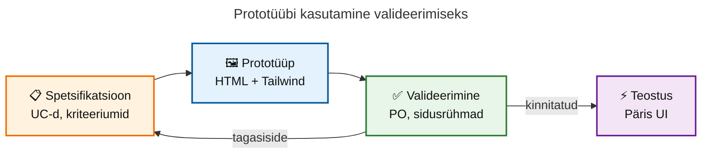
```mermaid
---
title: Prototüübi kasutamine valideerimiseks
---
flowchart LR
    SPEC["📋 Spetsifikatsioon<br/>UC-d, kriteeriumid"] --> PROTO["🖼️ Prototüüp<br/>HTML + Tailwind"]
    PROTO --> VALID["✅ Valideerimine<br/>PO, sidusrühmad"]
    VALID -->|"tagasiside"| SPEC
    VALID -->|"kinnitatud"| IMPL["⚡ Teostus<br/>Päris UI"]

    classDef spec fill:#fff3e0,stroke:#ef6c00,stroke-width:2px,color:#111111
    classDef proto fill:#e3f2fd,stroke:#01579b,stroke-width:2px,color:#111111
    classDef valid fill:#e8f5e9,stroke:#2e7d32,stroke-width:2px,color:#111111
    classDef impl fill:#f3e5f5,stroke:#6a1b9a,stroke-width:2px,color:#111111

    class SPEC spec
    class PROTO proto
    class VALID valid
    class IMPL impl
```

**Millal prototüüpida:**

- Uus ekraan või vaade, mida pole veel olemas
- Keeruline paigutus, mida on raske tekstiga kirjeldada
- Sidusrühmad vajavad visuaalset kinnitust enne teostust
- Mitu alternatiivset disaini, mille vahel valida

**Millal mitte prototüüpida:**

- Väikesed muudatused olemasolevale UI-le
- Puhtalt backend funktsionaalsus
- Standardsed CRUD ekraanid, mis järgivad olemasolevat mustrit

### Spetsifikatsioonide (spec) kvaliteet

| Põhimõte | Selgitus |
| :------- | :------- |
| **Inimloetavus ennekõike** | Kui spetsifikatsioon (spec) on liiga pikk, et seda läbi lugeda ja valideerida, on funktsionaalsus (feature) liiga suur |
| **Maksimaalne pikkus ~500 rida** | Pikemad spetsifikatsioonid kaotavad fookuse ja AI-l tekib "keskelt kaduma" probleem |
| **Alusta minimaalselt** | Ära kirjuta ette kõiki tulevikujuhtumeid — lisa detaile vastavalt vajadusele |
| **Spetsifikatsioon (spec) on elus dokument** | Spetsifikatsioon peab arenema koos projektiga, mitte jääma algversiooniks |

### Iteratiivne valideerimine

Iga faasi lõpus **peatu ja valideeri** enne järgmisse liikumist:

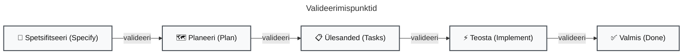
```mermaid
---
title: Valideerimispunktid
---
flowchart LR
    S["📝 Spetsifitseeri (Specify)"] -->|valideeri| P["🗺️ Planeeri (Plan)"]
    P -->|valideeri| T["📋 Ülesanded (Tasks)"]
    T -->|valideeri| I["⚡ Teosta (Implement)"]
    I -->|valideeri| D["✅ Valmis (Done)"]

    classDef phase fill:#f8f9fa,stroke:#495057,stroke-width:2px,color:#111111
    class S,P,T,I,D phase
```

**Küsimused valideerimiseks:**

- Kas spetsifikatsioon (spec) kajastab seda, mida tegelikult tahame ehitada?
- Kas plaan arvestab reaalsete piirangutega?
- Kas on äärjuhte, mida AI jättis märkamata?
- Kas ülesanded on piisavalt väikesed, et neid eraldi testida?

### Mahuhinnangud spetsifikatsioonipõhises arenduses

Traditsioonilised "story point" hinnangud ja sprindipõhine mahuarvestus kaovad, kuid **ajakulu ei kao**. Muutub see, **kuhu** aeg kulub. Koodi kirjutamine on AI-agendiga kiire, aga kvaliteetne analüüs, arhitektuur ja agendi juhtimine nõuavad endiselt inimese aega.

**Põhimõte:** "Odav teostus" ei tähenda "kiire projekt". Analüüs ja arhitektuur on investeering, mis määrab AI-agendi väljundi kvaliteedi.

**Kus aeg tegelikult kulub:**

| Tegevus | Kes | Mida sisaldab |
| :------ | :-- | :------------ |
| Analüüs ja spetsifitseerimine | Analüütik, PO | UC-de defineerimine, vastuvõtukriteeriumid, ärireeglite selgitamine, sidusrühmade kaasamine |
| Arhitektuur ja tehniline disain | Arhitekt | API lepingud, andmemudelid, piirangud, ADR-id, suunavad failid (steering) |
| AI-agendi juhtimine | Arendaja | Planeerimisrežiim (Plan Mode), valideerimine, paranduste suunamine, konteksti haldus |
| E2E testimine | E2E testija | Teststsenaariumide loomine, regressioonitestid, "smoke testid" |
| Ülevaatus ja kinnitamine | PO, Arhitekt | Spetsifikatsiooni (spec) ülevaatus, staatuse muutmine, kvaliteedikontroll |

**Traditsiooniline vs spetsifikatsioonipõhine ajakulu jaotus:**

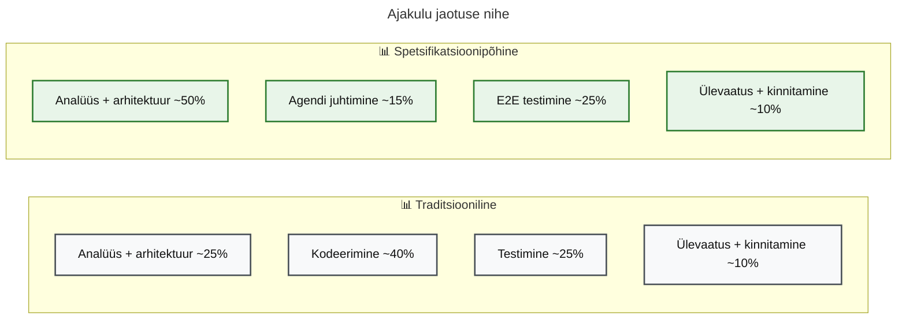
```mermaid
---
title: Ajakulu jaotuse nihe
---
flowchart LR
    subgraph Traditsiooniline["📊 Traditsiooniline"]
        T1["Analüüs + arhitektuur ~25%"]
        T2["Kodeerimine ~40%"]
        T3["Testimine ~25%"]
        T4["Ülevaatus + kinnitamine ~10%"]
    end

    subgraph Uus["📊 Spetsifikatsioonipõhine"]
        U1["Analüüs + arhitektuur ~50%"]
        U2["Agendi juhtimine ~15%"]
        U3["E2E testimine ~25%"]
        U4["Ülevaatus + kinnitamine ~10%"]
    end

    classDef trad fill:#f8f9fa,stroke:#495057,stroke-width:2px,color:#111111
    classDef new fill:#e8f5e9,stroke:#2e7d32,stroke-width:2px,color:#111111

    class T1,T2,T3,T4 trad
    class U1,U2,U3,U4 new
```

> **NB:** Protsendid on illustratiivsed ja sõltuvad projekti iseloomust. Oluline on trend: aeg nihkub **kodeerimiselt analüüsi, arhitektuuri ja kvaliteedikontrolli suunas**.

**Juhised hinnangu andmiseks:**

- **Hinda analüüsi ja arhitektuuri eraldi** — need on suurimad ajakulud ja neid ei tohi kokku suruda ühe "arendus" sildi alla
- **Agendi juhtimine ei ole null** — isegi hea spetsifikatsiooni korral kulub aega planeerimisrežiimile (Plan Mode), väljundi valideerimisele ja paranduste suunamisele
- **E2E testimine vajab eraldi hinnangut** — testija ei saa alustada enne, kui teostus on piisavalt valmis; see lisab sõltuvuse
- **Iteratsioon on osa hinnangust** — esimene versioon pole kunagi lõplik; arvesta spetsifikatsiooni täiendamise ja korduvate tsüklite aega
- **Kalibreerumine aja jooksul** — jälgi tegelikku ajakulu ja korrigeeri hinnanguid järgmisteks iteratsioonideks

**Soovitused alustamiseks:**

1. Esimeste funktsionaalsuste puhul ära anna kindlaid hinnanguid — jälgi tegelikku ajakulu
2. Pärast 2-3 iteratsiooni tekib meeskonnal tunnetus, kui palju aega iga faas tegelikult võtab
3. Kasuta lihtsat ajajälgimist faaside kaupa (analüüs, arhitektuur, agendi juhtimine, testimine)
4. Ära võrdle otse traditsioonilise arenduse hinnangutega — kontekst on teistsugune

### Testid kui spetsifikatsiooni kontroll

AI-agent **peab** kirjutama vähemalt:

- ühiktestid (unit tests) — komponentide/funktsioonide loogika kontroll
- integratsioonitestid (integration tests) — kihtide ja teenuste koostoime kontroll

E2E testija **lisab** eraldi testireposse:

- "end-to-end" testid — kasutajateede läbimine (browser-based)
- "smoke testid" — kriitiliste voogude kiire tervisekontroll pärast "deployment'i"
- regressioonitestid — tagab, et uued muudatused ei riku olemasolevat funktsionaalsust

**Oluline:** kõigi testide sisu peab tulenema spetsifikatsiooni (spec) vastuvõtukriteeriumidest (acceptance criteria). E2E testija kasutab sama spetsifikatsiooni, et luua teststsenaariumid, mis katavad kasutajateed otsast lõpuni.

### Cursori reeglid ja oskused (rules & skills)

Cursor pakub kahte mehhanismi AI agendi juhendamiseks:

| Mehhanism | Asukoht | Otstarve |
| :-------- | :------ | :------- |
| **Reeglid (Rules)** | `.cursor/rules/*.mdc` | Automaatsed mustrid, mis rakenduvad alati või kindlate failide korral |
| **Oskused (Skills)** | `.cursor/skills/*/SKILL.md` | Manuaalselt aktiveeritavad töövood konkreetseteks ülesanneteks |

**Reeglid** on reaktiivsed — need aktiveeruvad automaatselt, kui AI töötab teatud failidega (glob-muster) või alati.

**Oskused** on proaktiivsed töövood — kasutaja või AI kutsub neid välja, kui ülesanne nõuab kindlat protsessi (nt "implement task", "edit spec").

#### Cursori reeglid (.mdc failid)

Cursori reeglid (Cursor Rules) on `.cursor/rules/` kaustas asuvad `.mdc` failid, mis juhendavad AI agenti automaatselt. Need kehtivad **kõigile rollidele** ja aitavad hoida järjepidevust.

| Reegli tüüp | Millal rakendub | Kasutus |
| :---------- | :-------------- | :------ |
| **Alati (Always)** | Iga vestlus | Üldised projekti standardid (keel, formaat) |
| **Automaatne (Auto, globs)** | Kui töötad kindla failimustriga | `specs/**/*.spec.md` → spetsifikatsiooni (spec) kirjutamise juhised |
| **Agendi otsustatud (Agent-decided)** | AI otsustab kirjelduse põhjal | Spetsiifilised mustrid (nt API disain) |
| **Käsitsi (Manual)** | Kui kasutaja viitab @-ga | Harva kasutatavad, kuid olulised reeglid |

**Näited rollide kaupa:**

| Roll | Reegli näide | Glob muster |
| :--- | :----------- | :---------- |
| PO | Speci staatuse haldus (frontmatter), prioriteedi märkimine | `specs/**/*.spec.md`, `tasks.md` |
| Analüütik | Spetsifikatsiooni (spec) struktuur, UC nimetamine, metaandmed (frontmatter) | `specs/**/*.spec.md` |
| Arhitekt | API lepingute formaat, ADR struktuur | `architecture/**/*.md`, `adr/*.md`, `contracts/**/*.yaml` |
| Arendaja | Koodi stiil, testide nõuded, sissekande (commit) sõnumid | `src/**/*.ts`, `src/**/*.vue` |
| E2E testija | Teststsenaariumide struktuur, nimetamine, "fixtures" | `tests/**/*.spec.ts`, `tests/**/*.test.ts` |

**Soovitused:**

- Hoia reeglid lühikesed (< 50 rida) ja fokuseeritud
- Lisa reeglisse nii hea kui halva näide — AI õpib paremini
- Loo reegleid orgaaniliselt: kui AI teeb korduvalt sama vea, loo reegel
- Konsolideeri sarnased reeglid ühte faili, kui neid koguneb palju

> **Näide:** Kui analüütik unustab pidevalt metaandmeid (frontmatter) lisada, loo reegel `spec.mdc` globiga `specs/**/*.spec.md`, mis tuletab meelde prioriteedi ja speci `status` välja lisamist.

#### Cursori oskused (Skills)

Oskused on `.cursor/skills/*/SKILL.md` failid, mis kirjeldavad **konkreetseid töövoogusid**. Erinevalt reeglitest, mis rakenduvad automaatselt, aktiveerib oskusi AI vastavalt ülesande tüübile.

**Tüüpilised oskused spetsifikatsioonide repos:**

| Oskus | Millal aktiveerub | Mida teeb |
| :---- | :---------------- | :-------- |
| `implement-task` | "Implement task X", "next task", "continue" | Loeb speci, teostab õiges repos, märgib valmis |
| `edit-spec` | "Update spec", "change requirements", "add feature to spec" | Muudab speci JA propageerib kõikidesse mõjutatud dokumentidesse |

**Oluline:** Oskused peavad sisaldama ka viiteid muudele dokumentidele, mida muudatuste korral uuendada (nt `methodology/spec-driven-development.md` kui praktika muutub).

**Oskuste struktuur:**

```text
.cursor/skills/
├── implement-task/
│   └── SKILL.md              # Ülesande teostamise töövoog
└── edit-spec/
    └── SKILL.md              # Spetsifikatsiooni muutmise töövoog
```

### Spetsifikatsioonide muutmise töövoog

Kui nõuded muutuvad, ei piisa ainult ühe faili muutmisest. **Muudatus peab propageeruma kõikidesse mõjutatud dokumentidesse.**

**Kuldreegel:** Speci muudatus ei ole valmis enne, kui kõik mõjutatud dokumendid on uuendatud.

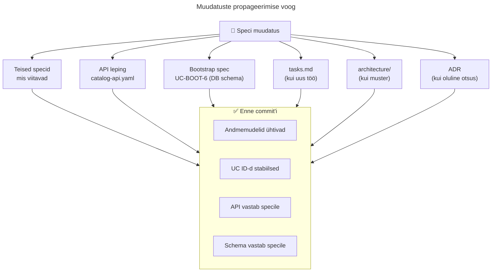
```mermaid
---
title: Muudatuste propageerimise voog
---
flowchart TD
    CHANGE["📝 Speci muudatus"] --> A["Teised specid<br/>mis viitavad"]
    CHANGE --> B["API leping<br/>catalog-api.yaml"]
    CHANGE --> C["Bootstrap spec<br/>UC-BOOT-6 (DB schema)"]
    CHANGE --> D["tasks.md<br/>(kui uus töö)"]
    CHANGE --> E["architecture/<br/>(kui muster)"]
    CHANGE --> F["ADR<br/>(kui oluline otsus)"]
    
    subgraph Valideerimine["✅ Enne commit'i"]
        V1["Andmemudelid ühtivad"]
        V2["UC ID-d stabiilsed"]
        V3["API vastab specile"]
        V4["Schema vastab specile"]
    end
    
    A --> Valideerimine
    B --> Valideerimine
    C --> Valideerimine
    D --> Valideerimine
    E --> Valideerimine
    F --> Valideerimine

```

**Propageerimise kontrollnimekiri:**

- [ ] Põhi-spec uuendatud
- [ ] Kõik viitavad specid uuendatud
- [ ] API leping uuendatud (kui API mõjutatud)
- [ ] Bootstrap UC-BOOT-6 uuendatud (kui DB mõjutatud)
- [ ] tasks.md uuendatud (kui uus töö)
- [ ] architecture/ uuendatud (kui muster)
- [ ] ADR loodud (kui oluline otsus)
- [ ] Kõik muudatused ühes commit'is

### `ready` ja `implemented` speci muutmise reegel

Kui spec on juba kinnitatud (`ready`) või realiseeritud (`implemented`), muuda seda vastavalt selle olekule (YAML frontmatter `status`):

- kui spec on `ready` ja vajab enne teostust sisulist muudatust, vii canonical spec-failis frontmatter `status` tagasi `draft`-i ja redigeeri speci otse põhi-specis
- kui spec on `implemented` ja sellest on juba tuletatud `tasks.md`, `contracts/`, `architecture/` või teostus, siis käitumuslikke muudatusi ei tee enam ainult otse põhi-specis; loo esmalt eraldi muutusekirje fail kausta `specs/changes/` nimetusega `change-{spec-base-name}-{slug}.md` (nt `change-frontend-bootstrap-build-validation.md`)

**Kasuta `change`-faili siis, kui:**

- muudad olemasoleva `implemented` speci käitumist, UC-de vooge või vastuvõtukriteeriume (`MODIFIED`)
- eemaldad või deprekateerid varasema `implemented` speci käitumist või UC-d (`REMOVED`)
- üks muudatus puudutab korraga mitut realiseeritud UC-d või seotud artefakte

**Soovituslik sisu `change`-failis:**

YAML frontmatter:

- `status: draft` (muutub `ready` pärast ülevaatust — samad staatused mis spec-failidel)
- `change_type: added | modified | removed`
- `affected_specs:` — nimekiri mõjutatud spec-failidest

Sisu (markdown):

- lühike kokkuvõte ja äriline põhjendus
- delta: praegune vs pakutud käitumine / kriteeriumid
- mõju `tasks.md`-le, `contracts/`-le ja `architecture/`-le
- liitmisreegel (merge rule): sammud, mida change'i liitmisel teha

**Oluline:** juba tehtud ülesandeid ei märgita tagasi tegemata. Kui realiseeritud spec muutub, lisatakse vajadusel uued jätkuülesanded `tasks.md`-sse. Git hoiab failide ajalugu, kuid `change` hoiab muudatuse ärilise tähenduse ja mõjuanalüüsi, kuni see liidetakse canonical speciga.

Kui spec on `draft`, võid seda endiselt otse põhi-specis muuta. Kui `ready` spec muutub sisuliselt, vii see enne muutmist frontmatteris tagasi `draft`-iks.

**Täpsustus:** `change` ei pea hõlmama tervet speci. Enamasti kirjeldab `change` osa sama spec-faili sisu kohta. Viita change-failis mõjutatud specile (frontmatter `affected_specs`) ja vajadusel konkreetsetele UC-dele tekstis jälgitavuse eesmärgil.

**Uue UC lisamine:** uue UC võid lisada otse canonical spec'i, kui spec on `draft`. Kui spec on juba `implemented`, käi uue või muudetud käitumuse kirjeldus läbi `change`-faili.

**`change`-failide elutsükkel:** pärast seda, kui muudatus on liidetud canonical speciga ja artefaktid on uuendatud, kustuta `change` fail — see on ajutine töödokument, mitte püsiv ajaloo allikas.

### Speci staatuste süsteem

Ühe spec-faili (`*.spec.md`) elutsükli staatus on **YAML frontmatteris** väljal `status`. Üks spec on elutsükli haldamise üksus; UC-id säilitavad stabiilseid ID-sid (`UC-XXX-N`) jälgitavuseks, kuid eraldi `Status:` ridu iga UC juures spec-failides ei kasutata.

| Speci staatus | Tähendus | Kas võib otse muuta? | Kas käitumuslik muudatus peab käima läbi `change`-i? |
| :------------ | :------- | :------------------- | :--------------------------------------------------- |
| `draft` | Spec on veel töös; UC-d, flow'd ja kriteeriumid võivad muutuda | Jah | Ei |
| `ready` | Spec on kinnitatud baseline ja valmis teostuseks | Jah, kui viid enne tagasi `draft`-i | Ei |
| `implemented` | Spec on realiseeritud ja valideeritud | Ei | Jah |

**Praktiline reegel:**

- `draft` spece võib otse canonical spec-failis muuta
- `ready` speci sisulise muudatuse korral sea frontmatter `status` tagasi `draft`-iks ja tee muudatus otse põhi-specis
- `implemented` speci käitumust muudetakse läbi `specs/changes/` (`change-{spec-base-name}-{slug}.md`); pärast liitmist canonical speciga kustuta `change` fail
- `tasks.md` ülesanded on **spec-põhised** (viitavad spec-failile või ülesande prefiksile), mitte eraldi UC staatuste järgi planeeritud
- uus UC lisa otse `draft` spec'i; `implemented` speci puhul kasuta `change`-faili

**Näide:**

```markdown
---
priority: high
status: ready
---

# Dashboard Specification

## Use Cases

### UC-DASH-1: View Summary

**Actor:** Authenticated user
...
```

**Võtmepunktid (frontmatter ja UC-id):**

- Frontmatter `status` — speci elutsükli jälgimiseks
- Frontmatter `priority` — ärilise prioriteedi jaoks
- UC nimetamine (`UC-DASH-1`) — viitamiseks koodis ja testides; elutsükli juhib spec, mitte eraldi UC staatus

Tehniline disain ei vaja eraldi elutsükli staatust UC tasemel; see kajastub `architecture/`, `contracts/` ja `tasks.md` artefaktides.

### Levinud vead (antimustrid / anti-patterns)

| Viga | Miks see kahjulik |
| :--- | :---------------- |
| **Spetsifikatsiooniteater (spec-teater)** | Kirjutatakse detailsed spetsifikatsioonid, mida keegi ei loe ega valideeri |
| **Ennatlik kõikehõlmavus** | Proovitakse kohe kõike ette spetsifitseerida, selle asemel et iteratiivselt täiendada |
| **Spetsifikatsiooni (spec) ja koodi lahknemine** | Spetsifikatsioon vananeb, kood areneb — tekib "kaks tõde" |
| **AI-genereeritud pundunud spetsifikatsioon** | AI toodab pikki spetsifikatsioone, mida keegi ei redigeeri kompaktsemaks |
| **Äärjuhtude eiramine** | Spetsifikatsioone analüüsitakse eraldi, unustades et funktsionaalsused (features) mõjutavad üksteist |

### Rollipõhised soovitused

| Roll | Tee nii | Ära tee nii |
| :--- | :------ | :---------- |
| **PO** | Kinnita speci staatus `ready` alles pärast ülevaatust | Ära kiirusta kinnitamisega ilma valideerimata |
| **PO** | Kui `ready` speci sisu muutub enne teostust, vii see tagasi `draft`-i | Ära ava sellise muudatuse jaoks asjatut `change`-faili |
| **PO** | Prioritiseeri äriväärtuse põhjal, hoia `tasks.md` ajakohasena | Ära dubleeri tööde nimekirja Jirasse ja tasks.md-sse |
| **Analüütik** | Keskendu ärinõuetele, kirjuta mõõdetavad vastuvõtukriteeriumid | Ära lisa tehnilist lahendust ega jäta nõudeid ebamääraseks |
| **Analüütik** | Kasuta järjekindlat UC nimetust (`UC-DASH-1`), viita seotud spec-idele | Ära dubleeri sisu spetsifikatsioonide vahel |
| **Arhitekt** | Loo arhitektuur `architecture/` kausta, halda `adr/`, `contracts/` ja `steering/`, lisa API lepingud näidetega | Ära kirjuta üle analüütiku spec-faile ega jäta liideseid ebamääraseks |
| **Arhitekt** | Viita ADR-dele ja aita draft spece viia staatusse `ready` | Ära jäta spece `draft` limbosse |
| **Arendaja** | Loe läbi nii spec kui arhitektuuridokument, kasuta Plan Mode'i | Ära hüppa otse teostusse ega leiuta oma liideseid |
| **Arendaja** | Uuenda `tasks.md` (ülesanded on spec-põhised), viita specile ja UC numbritele sissekandesõnumites | Ära jäta ülesandeid märkimata |
| **E2E testija** | Tuleta teststsenaariumid spec vastuvõtukriteeriumidest, viita UC numbritele | Ära kirjuta teste "tunnetuse" põhjal |
| **E2E testija** | Hoia testid eraldi E2E testirepos, uuenda regressiooniteste | Ära sega "end-to-end" teste ühiktestidega |

## Rollide kokkuvõte

- **PO**: prioritiseerib `tasks.md` ja `todo.md`, kinnitab specide staatuse `ready`, vajadusel avab `ready` speci tagasi `draft`-i, jälgib edenemist
- **Analüütik**: kirjutab `specs/**/*.spec.md`, määrab UC-d ja kriteeriumid, lisab spec-ülesandeid `tasks.md`-sse
- **Arhitekt**: vastutab `architecture/`, `adr/`, `contracts/` ja `steering/` kaustade eest — määrab tehniline disain, API lepingud, piirangud ja arhitektuuriotsused; lisab arhitektuuriülesandeid `tasks.md`-sse
- **AI-agent**: teostab `src/`, uuendab `tasks.md` staatust ja märgib realiseeritud specid `implemented`
- **E2E testija**: kirjutab "end-to-end", "smoke" ja regressioonitestid eraldi testireposse vastuvõtukriteeriumite põhjal

### Speci sisu: kohustuslik vs soovituslik

Spec-fail on tiimi tööriist, mitte bürokraatia. **Kohustuslik** on ainult minimaalne raamistik; ülejäänu kohandab tiim oma projekti ja domeeni järgi.

**Kohustuslik (iga spec-faili puhul):**

- YAML frontmatter väljadega `priority` ja `status`
- vähemalt üks UC stabiilse ID-ga (`UC-{PREFIX}-N`)
- vastuvõtukriteeriumid märkeruutudena (`- [ ]`)
- `## Related` sektsioon vähemalt ühe ristviitega

**Soovituslik (lisa vastavalt vajadusele):**

- Overview / probleemlause
- User Personas
- Data Model
- Non-Functional Requirements
- protsessivoog või diagramm
- UC sees: Actor, Trigger, Flow — nende detailsus sõltub domeenist

> **Põhimõte:** Spec on piisavalt detailne, et teine inimene (või AI-agent) saaks sellest üheselt aru ilma täiendavate selgitusteta. Kui mõni sektsioon ei anna väärtust, jäta see ära. Kui domeen vajab midagi, mida template ei kata (nt ärireeglite tabel, integratsiooniskeem), lisa see vabalt.

### 1 spec = 1 task = 1 agendi sessioon

Spec-fail on **implementeerimise aatomne ühik**. Iga spec-fail vastab täpselt ühele reale `tasks.md`-s ja üks AI-agent peab suutma selle tervenisti läbi lugeda, planeerida ja implementeerida **ühe sessiooni jooksul**.

**Reegel:**

- Üks spec-fail → üks rida `tasks.md`-s → üks agendi sessioon
- Kui spec on liiga suur (agent ei suuda seda ühe sessiooniga lõpuni viia), tükelda see väiksemateks spec-failideks alamkaustadesse
- Spec-failid on organiseeritud alamkaustadesse domeeni järgi: `specs/data-api/`, `specs/search/`, `specs/views/`, `specs/technology/`, `specs/deployment/`, `specs/debt/`, `specs/documentation/`, `specs/visualizations/`
- Tükeldamisel säilivad UC ID-d muutumatuna

**Mis on "liiga suur"?**

Kindlat rea-limiiti ei ole, aga hea rusikareegel: kui spec sisaldab üle 12 UC-d või üle 600 rida, siis tasub kaaluda tükeldamist. Oluline on et agent saaks terve speci korraga kontekstiaknasse ja suudaks kõiki UC-sid koos implementeerida.

**Tükeldamise näide:**

```text
specs/
├── data-api/
│   ├── repositories.spec.md      # UC-DATA-1, UC-DATA-2
│   ├── repository-extensions-core.spec.md   # UC-DATA-3, UC-DATA-4, UC-DATA-4a (seed / persisted rows)
│   ├── repository-extensions-graph.spec.md  # UC-DATA-4b–4d (after deploy linking + graph extraction)
│   ├── teams.spec.md             # UC-DATA-5, UC-DATA-6, UC-DATA-11–16
│   ├── dashboard.spec.md         # UC-DATA-7–10
│   └── tags.spec.md              # UC-DATA-14
```

**`tasks.md` formaat:**

```markdown
| ID | Spec | Repo | Depends | Status |
| -- | ---- | ---- | ------- | ------ |
| DA-REPO | data-api/repositories.spec.md | B | B1 | [x] |
| DA-EXT-CORE | data-api/repository-extensions-core.spec.md | B | DA-REPO | [ ] |
| DA-EXT-GRAPH | data-api/repository-extensions-graph.spec.md | B | DA-REPO, DL, DG | [ ] |
```

### Näide: spetsifikatsioonifaili (spec) struktuur

```markdown
---
priority: high
status: ready
---

# Dashboard Specification (Töölaua spetsifikatsioon)

## Overview (Ülevaade)

Dashboard provides a quick overview of the organization's software catalog
status and key metrics.

## User Personas (Kasutajapersoonad)

| Persona | Goal |
|---------|------|
| Chief Architect | Technical debt overview, identifying problem areas |
| Team Lead | Monitoring team repos and compliance |
| Developer | Finding components, understanding the landscape |

## Use Cases (Kasutusjuhud)

### UC-DASH-1: View Summary (Koondi vaatamine)

**Actor**: Authenticated user
**Trigger**: User opens the dashboard

**Displays:**
- Total repository count
- Average health score
- README compliance percentage

**Acceptance Criteria (Vastuvõtukriteeriumid):**
- [ ] All summary metrics are displayed on page load
- [ ] Metrics update after scanning
- [ ] Loading state is visible

## Non-Functional Requirements (Mittefunktsionaalsed nõuded)

| Requirement | Target |
|-------------|--------|
| Page load time | < 2 seconds |
| Data freshness | Updates after scan |

## Related (Seotud)

- [search/search-ui.spec.md](../specs/search/search-ui.spec.md) — Search functionality
- [visualizations/charts.spec.md](../specs/visualizations/charts.spec.md), [visualizations/advanced.spec.md](../specs/visualizations/advanced.spec.md) — Charts and graphs
```

**Võtmepunktid:**

- Frontmatter `status` — speci elutsükli jälgimiseks
- Frontmatter `priority` (ja vajadusel muud metaandmed) — ärilise prioriteedi ja dokumendi meta jaoks
- UC nimetamine (`UC-DASH-1`) — viitamiseks koodis ja testides; elutsükli juhib spec (frontmatter `status`), mitte eraldi UC staatus
- "Acceptance Criteria" märkeruutudena — saab märkida "tehtud"
- "Related" sektsioon — jälgitavus (traceability)

## Valikuline: piletihaldus (issue-tracker)

Soovi korral võib spetsifikatsiooni (spec) metaandmed (frontmatter) sisaldada `issue_id`, `issue_url`, `last_synced`. Töövoog toimib ka ilma selleta.

## Linkimise parimad praktikad

### Eelista standardset Markdown linki

Kasuta alati **tavalist Markdown linki**, sest see töötab GitHubis, GitLabis, Cursoris ja muudes editorites:

```markdown
[Search Spec](../specs/search/search-ui.spec.md)
[Backend Overview](architecture/backend/overview.md)
[API Contract](contracts/platform-team/order-service-api.yaml)
```

### Viita konkreetsele sektsioonile

Pealkirja viide teeb seose täpseks:

```markdown
[Vastuvõtukriteeriumid (Acceptance Criteria)](../specs/search/search-ui.spec.md#use-cases)
```

### Kasuta „Seotud (Related)" plokki

Iga spetsifikatsioon (spec) või arhitektuurifail võiks lõppeda seotud viidetega:

```markdown
## Seotud (Related)

- [specs/search/search-api.spec.md](../specs/search/search-api.spec.md), [specs/search/llm-intent.spec.md](../specs/search/llm-intent.spec.md) — API lepingud
- [architecture/backend/search.md](../architecture/backend/search.md) — backend disain
```

### Lisa semantikat metaandmetesse (frontmatter)

Kui vaja masinloetavat seost, kasuta lihtsat metaandmete skeemi:

```yaml
---
id: SPEC-SEARCH
type: spec
domain: search
related:
  - SPEC-SEARCH-API
  - ARCH-BE-SEARCH
---
```

### Hoia UC-id ühtse mustriga

Kasutusjuhud olgu alati stabiilsete ID-dega (jälgitavus koodis, testides ja viidetes); speci elutsükkel (draft / ready / implemented) on määratud spec-faili frontmatteris, mitte UC tasemel.

```markdown
### UC-SEARCH-3: Filtreeri tehnoloogiapinu järgi (Filter by tech stack)
```

### Väldi wiki-linke tootmiskoodis

`[[wikilink]]` süntaks on mugav Obsidianis, kuid **ei tööta** standardsetes Git repo vaadetes. Kui vaja, kasuta wiki-linke ainult isiklikes märkmetes.

## Seotud dokumendid

- [Cursor AI IDE](cursor-ai-tools.md) — Cursor seadistamine ja kasutamine
- [AI parimad tavad](ai-best-practices.md) — efektiivse ja ohutu AI kasutamise juhised
- [Prompting juhend](prompting-guide.md) — efektiivsete promptide loomine
- [Koodiülevaatus AI-ga](code-review-ai.md) — automatiseeritud kvaliteedikontroll

---

> **📝 Git-managed page:** This content is automatically synced from [IDP Documentation Repository](https://source.smit.sise/projects/IDP/repos/idp-docs/browse/docs/09-ai-development-tools/spec-driven-development.md). **Do not edit manually in Confluence** - all changes should be made in Git and will be automatically deployed.
